# Action

As **Actions** são os blocos fundamentais que definem **o que acontece** no seu jogo. Elas são disparadas pelos **Triggers** em resposta a eventos.

---

### [Blink Action](component/action/Action-Blink.md)
Faz com que o renderizador de um objeto pisque.

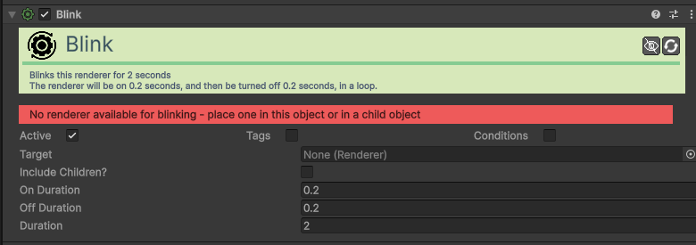

| Campo | Função | Detalhes |
| :--- | :--- | :--- |
| **Active / Tags / Cond.**| Comuns. | Ativação, etiquetas de busca e requisitos (Ex: ter a chave).|
| **Target** | Alvo. | O componente visual (Renderer) que irá piscar. |
| **Include Children?**| Filhos. | Se ativo, renderizadores nos objetos filhos também piscam. |
| **On Duration** | Ligado. | Tempo (segundos) visível em cada ciclo. |
| **Off Duration** | Desligado. | Tempo (segundos) invisível em cada ciclo. |
| **Duration** | Total. | Tempo total em segundos que o efeito dura. |

### [Change Action State Action](component/action/Action-Change-Action-State.md)
Ativa ou desativa outro componente de Ação.

| Campo | Função | Detalhes |
| :--- | :--- | :--- |
| **Active / Tags / Cond.**| Comuns. | Ativação, etiquetas e requisitos de execução. |
| **Target** | Alvo. | O componente `Action` alvo. |
| **State** | Novo Estado. | **Enable**, **Disable** ou **Toggle**. |

### [Change Collider Action](component/action/Action-Change-Collider.md)
Modifica o estado do colisor (Sólido vs Trigger) ou liga/desliga o próprio componente.

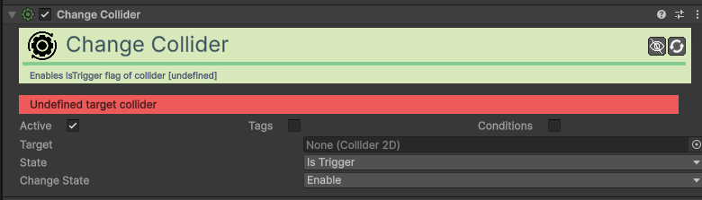

| Campo | Função | Detalhes |
| :--- | :--- | :--- |
| **Active / Tags / Cond.**| Comuns. | Ativação, etiquetas e requisitos de execução. |
| **Target** | Alvo. | O componente `Collider2D` que deseja modificar. |
| **State** | Propriedade. | O que alterar (ex: `Is Trigger`, `Enabled`). |
| **Change State** | Operação. | Como alterar: **Enable**, **Disable** ou **Toggle**. |

**Nota**: Se **State** for `Is Trigger`, `Enable` torna o objeto atravessável e `Disable` torna-o sólido.

### [Change Component State Action](component/action/Action-Change-Component-State.md)
Ativa ou desativa qualquer componente do Unity.

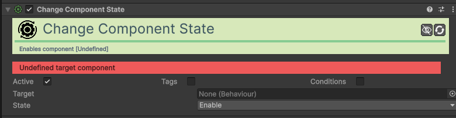

| Campo | Função | Detalhes |
| :--- | :--- | :--- |
| **Active / Tags / Cond.**| Comuns. | Ativação, etiquetas e requisitos de execução. |
| **Target** | Alvo. | O componente específico a ligar/desligar. |
| **State** | Novo Estado. | **Enable**, **Disable** ou **Toggle**. |

### [Change Movement Action](component/action/Action-Change-Movement.md)
Modifica as propriedades de movimento de um objeto.

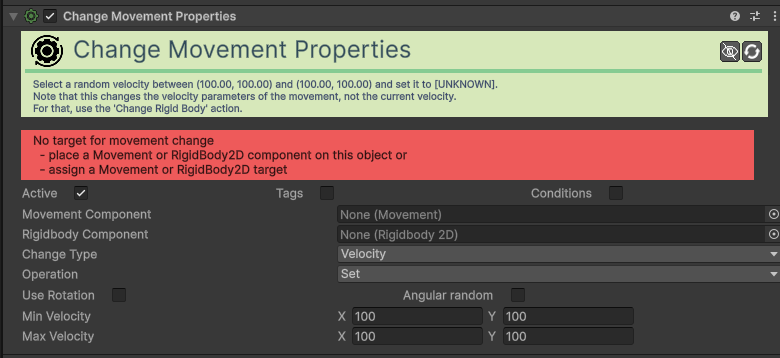

| Campo | Função | Detalhes |
| :--- | :--- | :--- |
| **Active / Tags / Cond.**| Comuns. | Definições padrão de execução e filtros. |
| **Movement Comp.** | Movimento. | Componente de movimento (Platformer, XY) a alterar. |
| **Rigidbody Comp.** | Física. | Componente Rigidbody2D a alterar. |
| **Change Type** | Tipo. | Atualmente focado em **Velocity** (parâmetros de base). |
| **Operation** | Operação. | **Set** (fixo), **Add** (somar), **Subtract** (subtrair). |
| **Use Rotation** | Rotação. | Se ativo, as direções são relativas ao objeto. |
| **Angular random** | Aleatório. | Aplica variação angular aleatória na velocidade. |
| **Min Velocity** | Vel. Mínima. | Valor mínimo (X, Y) para a nova velocidade. |
| **Max Velocity** | Vel. Máxima. | Valor máximo (X, Y). O resultado será entre Mín e Máx. |

### [Change Object State Action](component/action/Action-Change-Object-State.md)
Ativa ou desativa completamente um objeto da cena (GameObject).

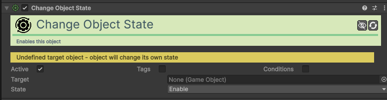

| Campo | Função | Detalhes |
| :--- | :--- | :--- |
| **Active / Tags / Cond.**| Comuns. | Ativação, etiquetas e requisitos de execução. |
| **Target** | Objeto Alvo. | O Game Object que deseja ligar ou desligar. |
| **State** | Novo Estado. | **Enable** (Liga), **Disable** (Desliga) ou **Toggle**. |

### [Change Particle System Action](component/action/Action-Change-Particle-System.md)
Controla a emissão de partículas de um sistema.

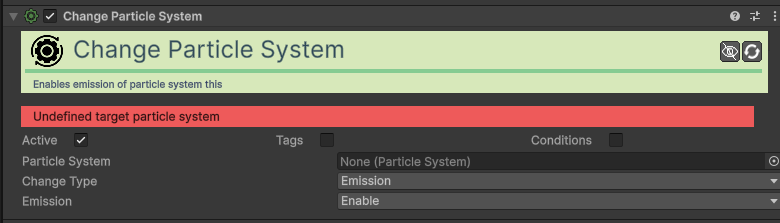

| Campo | Função | Detalhes |
| :--- | :--- | :--- |
| **Active / Tags / Cond.**| Comuns. | Ativação, etiquetas e requisitos de execução. |
| **Particle System** | Sistema. | O componente `ParticleSystem` alvo. |
| **Change Type** | Tipo. | Atualmente focado em **Emission** (Emissão). |
| **Emission** | Estado. | **Enable** (ligar), **Disable** (desligar) ou **Toggle**. |

### [Change Renderer Action](component/action/Action-Change-Renderer.md)
Modifica propriedades visuais como cor ou visibilidade do renderizador.

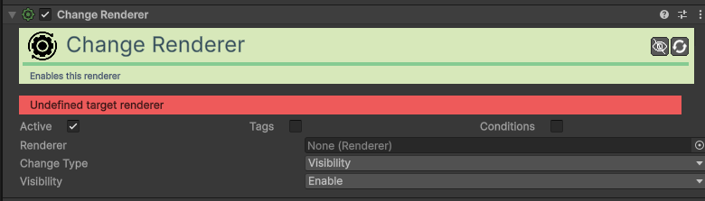

| Campo | Função | Detalhes |
| :--- | :--- | :--- |
| **Active / Tags / Cond.**| Comuns. | Ativação, etiquetas e requisitos de execução. |
| **Renderer** | Renderizador. | O componente visual (Sprite Renderer, etc) a modificar. |
| **Change Type** | Tipo. | Atualmente focado em **Visibility** (Visibilidade). |
| **Visibility** | Estado. | **Enable** (Torna visível), **Disable** (Esconde) ou **Toggle**. |

### [Change Resource Action](component/action/Action-Change-Resource.md)
Altera o valor de um recurso (ex: tirar vida ou dar mana).

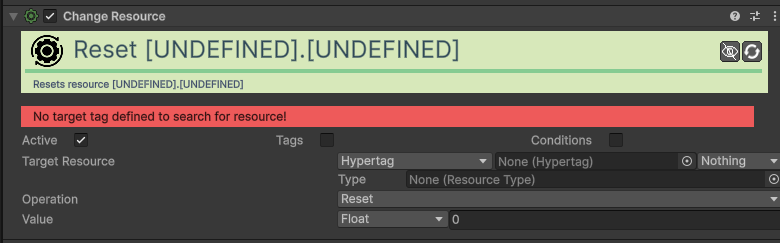

| Campo | Função | Detalhes |
| :--- | :--- | :--- |
| **Active / Tags / Cond.**| Comuns. | Definições padrão de execução. |
| **Target Resource** | Alvo. | Onde procurar o recurso (via Hypertag ou Objeto). |
| **Type** | Recurso. | O tipo de recurso (ex: Vida, Moedas). |
| **Operation** | Operação. | **Add**, **Subtract**, **Set**, **Reset**, **Multiply**, **Divide**. |
| **Value** | Valor. | Valor a aplicar (pode ser fixo ou de outra variável). |

### [Change Rigid Body Action](component/action/Action-Change-Rigid-Body.md)
Altera propriedades físicas do Rigidbody2D (velocidade, massa, etc).

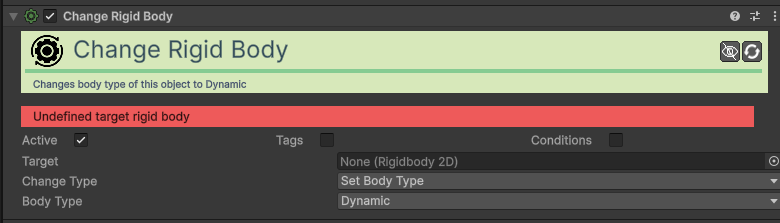

| Campo | Função | Detalhes |
| :--- | :--- | :--- |
| **Active / Tags / Cond.**| Comuns. | Ativação, etiquetas e requisitos de execução. |
| **Target** | Alvo. | O componente `Rigidbody2D` a modificar. |
| **Change Type** | Tipo. | Define o que alterar (ex: **Set Body Type**, **Set Mass**). |
| **Value** | Valor. | O novo valor ou estado a aplicar conforme o tipo escolhido. |

### [Change Scene Action](component/action/Action-Change-Scene.md)
Carrega uma nova cena ou recarrega a atual.

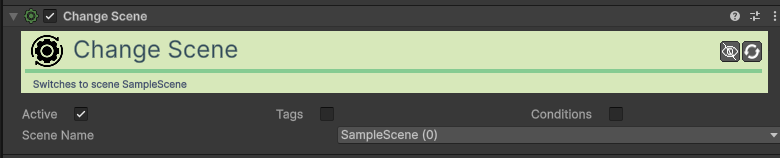

| Campo | Função | Detalhes |
| :--- | :--- | :--- |
| **Active / Tags / Cond.**| Comuns. | Ativação e condições para mudar de cena. |
| **Scene Name** | Nome da Cena. | O nome exato da cena a carregar. |

### [Change Sound Action](component/action/Action-Change-Sound.md)
Altera propriedades de um som em execução ou do Sound Manager.

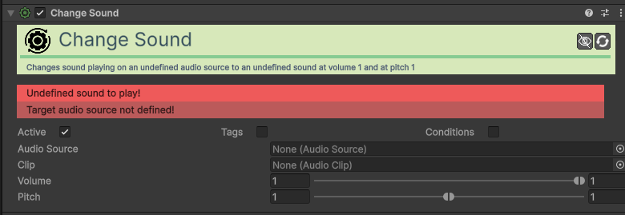

| Campo | Função | Detalhes |
| :--- | :--- | :--- |
| **Active / Tags / Cond.**| Comuns. | Ativação e requisitos de áudio. |
| **Audio Source** | Fonte. | O componente `AudioSource` que está a tocar o som. |
| **Clip** | Novo Som. | O ficheiro de som (`AudioClip`) a ser carregado. |
| **Volume** | Volume. | Define a intensidade do som (0 a 1). |
| **Pitch** | Tom. | Define a tonalidade e velocidade de reprodução. |

### [Change Sprite Renderer Action](component/action/Action-Change-Sprite-Renderer.md)
Altera propriedades específicas do Sprite Renderer (ex: Flip, Sprite).

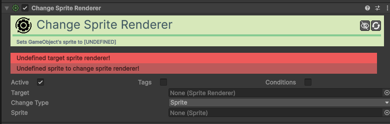

| Campo | Função | Detalhes |
| :--- | :--- | :--- |
| **Active / Tags / Cond.**| Comuns. | Ativação e etiquetas do renderizador. |
| **Target** | Alvo. | O Sprite Renderer a modificar. |
| **Change Type** | Tipo. | **Sprite**, **Color** ou **Flip X/Y**. |
| **Sprite / Color** | Novos Valores. | A imagem ou cor a aplicar conforme o modo. |
| **Bool State** | Estado Flip. | Liga/Desliga o flip (se no modo Flip). |

### [Change System Option Action](component/action/Action-Change-System-Option.md)
Altera definições globais do sistema de jogo (ex: Volume, Dificuldade).

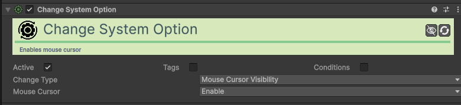

| Campo | Função | Detalhes |
| :--- | :--- | :--- |
| **Change Type** | Opção. | Atualmente focado na **Visibilidade do Cursor** do rato. |
| **State** | Estado. | **Enable** (Mostra o cursor), **Disable** (Esconde) ou **Toggle**. |

### [Change Tile Action](component/action/Action-Change-Tile.md)
Altera um tile específico num Tilemap (ex: abrir porta de tiles).

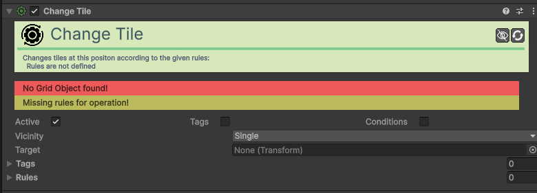

| Campo | Função | Detalhes |
| :--- | :--- | :--- |
| **Active / Tags / Cond.**| Comuns. | Ativação e requisitos para troca de tiles. |
| **Tilemap** | Mapa. | O componente Tilemap a modificar. |
| **Vicinity Type** | Área. | **Single**, **FourWay/EightWay** ou **Circle**. |
| **Radius** | Raio. | Tamanho da área afetada (no modo Circle). |
| **Rules** | Regras. | Lista de "Trocar Tile A por Tile B". |

### [Change Trail Renderer Action](component/action/Action-Change-Trail-Renderer.md)
Ativa ou desativa um rastro visual (Trail).

| Campo | Função | Detalhes |
| :--- | :--- | :--- |
| **Active / Tags / Cond.**| Comuns. | Ativação e etiquetas do rasto. |
| **Target** | Trail Renderer. | O componente de rasto alvo. |
| **Emitter** | Emissão. | **Enable**, **Disable** ou **Toggle**. |

### [Change Transform Action](component/action/Action-Change-Transform.md)
Altera posição, rotação ou escala diretamente sem física.

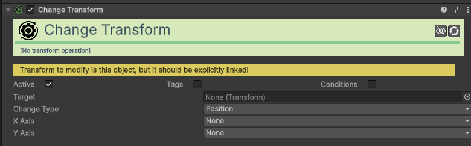

| Campo | Função | Detalhes |
| :--- | :--- | :--- |
| **Active / Tags / Cond.**| Comuns. | Ativação e condições da ação. |
| **Change Type** | Tipo. | **Position** (Posição) ou **Scale** (Tamanho). |
| **X/Y Axis** | Eixos. | Operação para cada eixo (Set, Add, etc). |
| **Position / Delta**| Valores. | Valores para definir ou somar (suporta aleatórios). |
| **ScaleWithTime** | Velocidade? | Se ativo, a alteração é feita por segundo. |

### [Change Trigger State Action](component/action/Action-Change-Trigger-State.md)
Ativa ou desativa um Trigger.

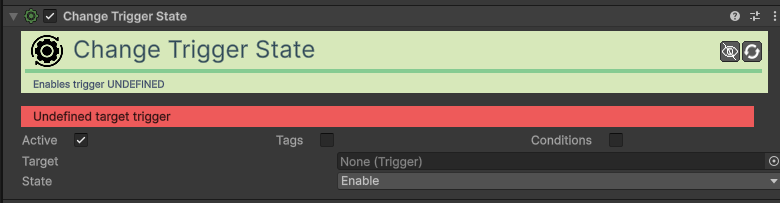

| Campo | Função | Detalhes |
| :--- | :--- | :--- |
| **Active / Tags / Cond.**| Comuns. | Ativação e requisitos do trigger. |
| **Target** | Trigger Alvo. | O componente `Trigger` a modificar. |
| **State** | Novo Estado. | **Enable**, **Disable** ou **Toggle**. |

### [Change Value Action](component/action/Action-Change-Value-V2.md)
Altera o valor de uma variável local ou global.

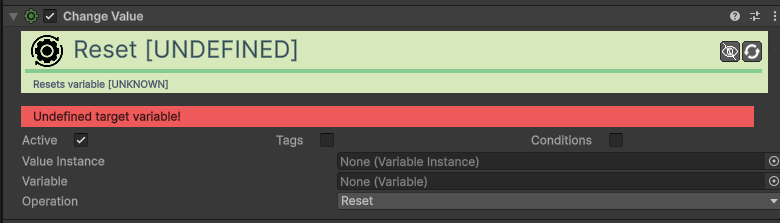

| Campo | Função | Detalhes |
| :--- | :--- | :--- |
| **Active / Tags / Cond.**| Comuns. | Ativação e requisitos do valor. |
| **Value** | Variável. | A variável local ou global a alterar. |
| **Operation** | Operação. | **Set**, **Add**, **Subtract**, **Multiply**, **Divide**. |
| **Change Value** | Valor. | O número, valor aleatório ou outra variável a aplicar. |

### [Dash Action](component/action/Action-Dash.md)
Executa um movimento rápido (dash) numa direção.

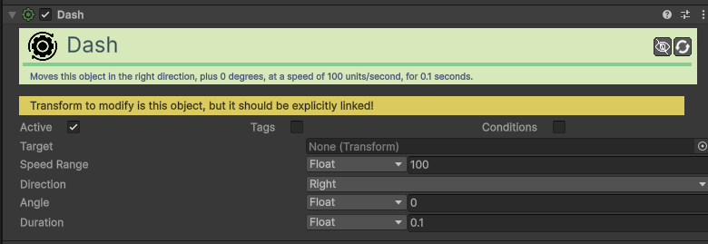

| Campo | Função | Detalhes |
| :--- | :--- | :--- |
| **Active / Tags / Cond.**| Comuns. | Ativação e requisitos do dash. |
| **Speed** | Velocidade. | A rapidez do movimento. |
| **Duration** | Duração. | Tempo em segundos do impulso. |
| **Direction** | Direção. | **Right/Up** (Global) ou **Local Right/Up**. |
| **Angle** | Ângulo. | Rotação extra à direção base. |

### [Destroy Object Action](component/action/Action-Destroy-Object.md)
Remove um objeto da cena permanentemente.

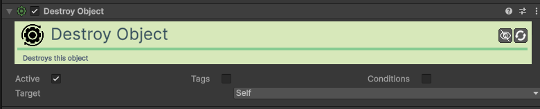

| Campo | Função | Detalhes |
| :--- | :--- | :--- |
| **Active / Tags / Cond.**| Comuns. | Ativação e requisitos de destruição. |
| **Target** | Alvo. | **Self**, **Parent**, **Topmost**, **Object**, **Tag**, **Collider**. |

### [Flash Action](component/action/Action-Flash-V2.md)
Cria um efeito de flash cromático num renderizador.

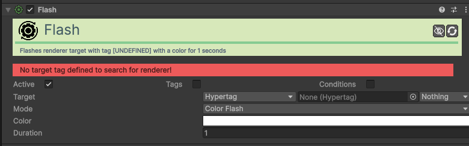

| Campo | Função | Detalhes |
| :--- | :--- | :--- |
| **Active / Tags / Cond.**| Comuns. | Ativação e condições de disparo. |
| **Target** | Alvo. | O componente visual a iluminar (via Hypertag ou Objeto). |
| **Mode** | Tipo. | **Color Flash**, **Invert Color** ou **Smooth Invert**. |
| **Color** | Cor. | A cor usada no flash (suporta gradientes). |
| **Duration** | Duração. | Tempo total do efeito em segundos. |

### [Play Particle System Action](component/action/Action-Play-Particle-System.md)
Inicia a reprodução de um sistema de partículas existente.

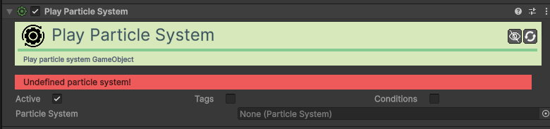

| Campo | Função | Detalhes |
| :--- | :--- | :--- |
| **Active / Tags / Cond.**| Comuns. | Ativação e etiquetas do sistema. |
| **Target** | Sistema. | O `ParticleSystem` a tocar. |

### [Play Sound Action](component/action/Action-Play-Sound.md)
Toca um efeito sonoro (SFX).

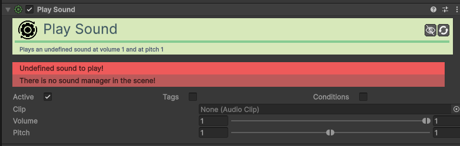

| Campo | Função | Detalhes |
| :--- | :--- | :--- |
| **Active / Tags / Cond.**| Comuns. | Ativação e condições de áudio. |
| **Clip** | Áudio. | O ficheiro de som (AudioClip). |
| **Volume / Pitch** | Ajustes. | Suporta intervalos aleatórios para variar o som (SFX). |

### [Quest Control (Fail/Give/Remove) Action](component/action/Action-Quest-Give.md)
Gere o estado das missões (Dar, Falhar ou Remover).

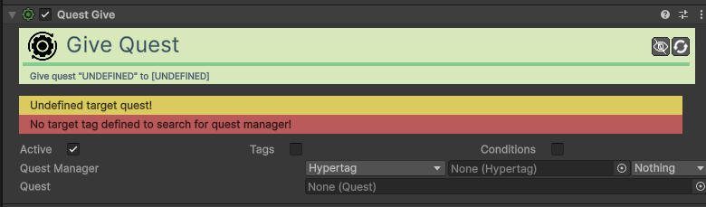

| Campo | Função | Detalhes |
| :--- | :--- | :--- |
| **Active / Tags / Cond.**| Comuns. | Ativação e condições da missão. |
| **Quest Manager** | Gestor. | O componente que gere as missões. |
| **Quest** | Missão. | O asset da missão (Quest Asset) a gerir. |

### [Quit Application Action](component/action/Action-Quit-Application.md)
Fecha o jogo.

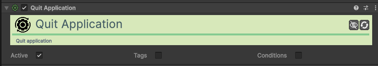

### [Random Action](component/action/Action-Random.md)
Executa uma ação aleatória baseada em pesos.

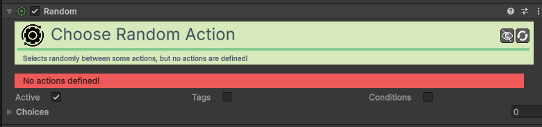

| Campo | Função | Detalhes |
| :--- | :--- | :--- |
| **Actions** | Lista de Ações. | Lista de ações possíveis para escolher. |
| **Probability** | Peso. | Probabilidade relativa de cada ação ser escolhida. |

### [Rotate Towards Action](component/action/Action-Rotate-Towards.md)
Roda o objeto para apontar na direção de um alvo.

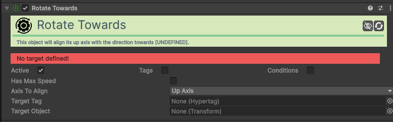

| Campo | Função | Detalhes |
| :--- | :--- | :--- |
| **Active / Tags / Cond.**| Comuns. | Ativação e condições de rotação. |
| **Target Object** | Alvo. | Objeto específico para onde olhar. |
| **Target Tag** | Tag Alvo. | Aponta para o objeto mais próximo com esta tag. |
| **Axis to Align** | Eixo. | **Up Axis** (Y) ou **Right Axis** (X). |
| **Has Max Speed** | Gradual? | Se ativo, roda suavemente. Se não, é instantâneo. |
| **Speed** | Velocidade. | Graus por segundo (se gradual). |

### [Sequence Action](component/action/Action-Sequence.md)
Executa várias ações em série com intervalos.

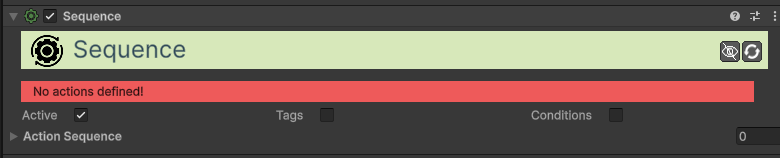

| Campo | Função | Detalhes |
| :--- | :--- | :--- |
| **Active / Tags / Cond.**| Comuns. | Ativação e condições da sequência. |
| **Actions** | Ações. | Sequência de ações a serem executadas. |
| **Delay** | Atraso. | Espera (segundos) antes de cada ação ser disparada. |

### [Set Animation Parameter Action](component/action/Action-Set-Animation-Parameter.md)
Define parâmetros no Animator do Unity.

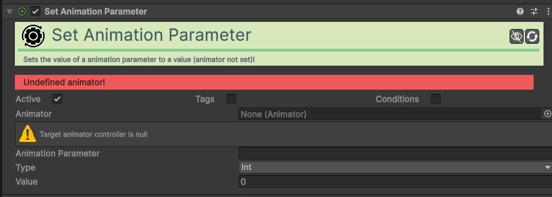

| Campo | Função | Detalhes |
| :--- | :--- | :--- |
| **Active / Tags / Cond.**| Comuns. | Ativação e condições de animação. |
| **Animator** | Animador. | O componente `Animator` alvo. |
| **Parameter** | Parâmetro. | Nome exato (ex: "IsDead", "Speed"). |
| **Value Type** | Tipo. | **Int**, **Float**, **Bool**, **Trigger**, **Velocity X/Y**. |

### [Set Outline Action](component/action/Action-Set-Outline.md)
Ativa ou altera o contorno (outline) de um objeto.

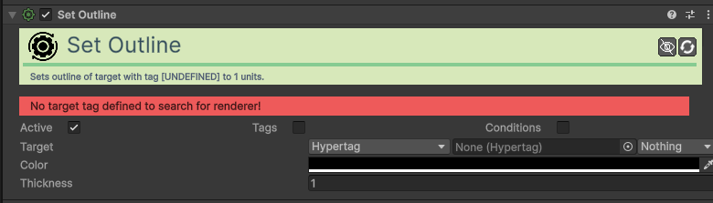

| Campo | Função | Detalhes |
| :--- | :--- | :--- |
| **Active / Tags / Cond.**| Comuns. | Ativação e etiquetas do contorno. |
| **Color** | Cor. | A cor da linha de contorno. |
| **Thickness** | Espessura. | Largura da linha (0 remove o contorno). |

### [Set Parent Action](component/action/Action-Set-Parent.md)
Muda a hierarquia de um objeto.

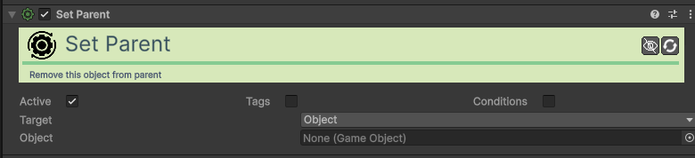

| Campo | Função | Detalhes |
| :--- | :--- | :--- |
| **Active / Tags / Cond.**| Comuns. | Ativação e requisitos de hierarquia. |
| **Target Object** | Objeto. | O objeto que mudará de pai. |
| **New Parent**| Novo Pai. | Definido por **Tag** ou referência direta. |

### [Shake Action](component/action/Action-Shake.md)
Cria um efeito de agitação (shake) no objeto ou câmara.

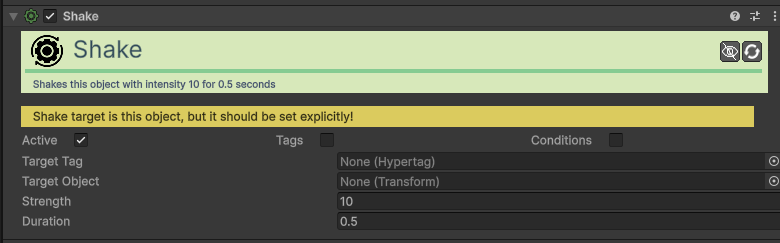

| Campo | Função | Detalhes |
| :--- | :--- | :--- |
| **Active / Tags / Cond.**| Comuns. | Ativação e requisitos do shake. |
| **Object** | Alvo. | O objeto a agitar (ex: "MainCamera"). |
| **Strength** | Força. | Intensidade da vibração. |
| **Duration** | Duração. | Tempo do efeito em segundos. |

### [Spawn Action](component/action/Action-Spawn.md)
Cria um novo objeto (Prefab) na cena.

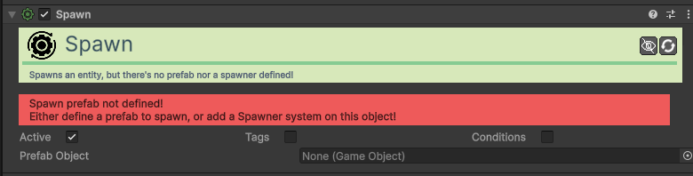

| Campo | Função | Detalhes |
| :--- | :--- | :--- |
| **Active / Tags / Cond.**| Comuns. | Ativação e requisitos de nascimento. |
| **Prefab Object** | Molde. | O Prefab do objeto a ser criado. |
| **Spawn Position** | Posição. | **This**, **Target** ou **Tag**. |
| **Set Parent** | Parentesco. | Se ativo, torna-se filho da origem. |

### [Run Tagged Action Action](component/action/Action-Tagged.md)
Executa ações baseando-se em etiquetas (Hypertags).

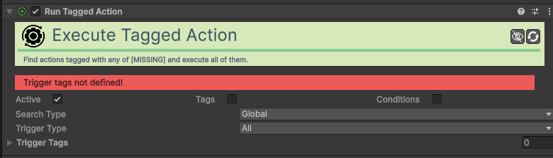

| Campo | Função | Detalhes |
| :--- | :--- | :--- |
| **Active / Tags / Cond.**| Comuns. | Ativação e requisitos da busca. |
| **Search Type** | Onde Buscar. | **Global**, **Children**, **Tagged**, **Within Collider**. |
| **Search Tags** | Tags Busca. | Tags dos objetos onde as ações estão. |
| **Trigger Type** | Ativação. | **All**, **Sequence** ou **Random**. |
| **Trigger Tags** | Tags Ação. | Tags das `Action` específicas a ativar. |

### [Teleport Action](component/action/Action-Teleport.md)
Teletransporta um objeto para uma nova posição.

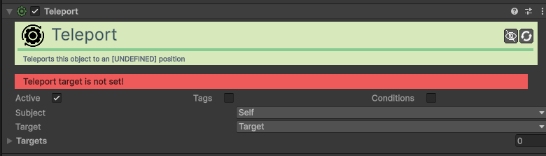

| Campo | Função | Detalhes |
| :--- | :--- | :--- |
| **Active / Tags / Cond.**| Comuns. | Ativação e requisitos de destino. |
| **Subject** | Quem Mover. | **Self**, **Target**, **Tag**, **Collider**. |
| **Teleport Target** | Destino. | **Target** ou **Tag**. |
| **Target Transf.** | Pontos. | Lista de pontos possíveis para o teletransporte. |

### [Token (Give/Remove) Action](component/action/Action-Token-Give.md)
Atribui ou retira tokens de estado/progresso.

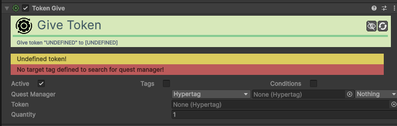

| Campo | Função | Detalhes |
| :--- | :--- | :--- |
| **Active / Tags / Cond.**| Comuns. | Ativação e requisitos do token. |
| **Quest Manager** | Gestor. | O componente central que guarda tokens. |
| **Token** | Tipo Token. | A Hypertag que representa o item. |
| **Quantity** | Quantidade. | Quantos tokens o jogador recebe/perde. |

### [Run Unity Event Action](component/action/Action-Unity-Event.md)
Chama funções externas ou scripts personalizados.

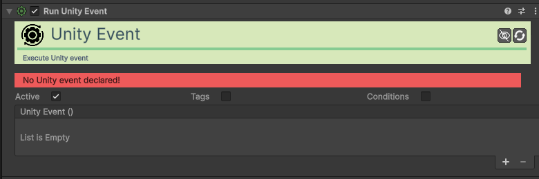

| Campo | Função | Detalhes |
| :--- | :--- | :--- |
| **Unity Event** | Evento. | Lista padrão do Unity para arrastar objetos e escolher funções. |
