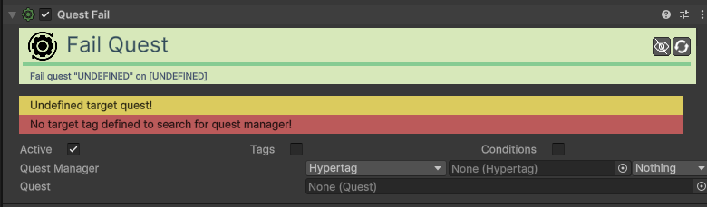

# Action-Quest-Fail

[:material-code-tags: Ver Código Fonte C#](https://github.com/VideojogosLusofona/OkapiKit/blob/main/Assets/OkapiKit/Scripts/Actions/ActionQuestFail.cs){ .md-button }

Marca uma missão específica como falhada.

## Configurações do Inspector

| Campo | Função | Detalhes |
| :--- | :--- | :--- |
| **Active** | Ativação | Define se o componente está ligado e pronto para funcionar. |
| **Tags** | Etiquetas | Etiquetas inteligentes (Hypertags) usadas para identificação e filtros. |
| **Conditions** | Condições | Lista de requisitos (ex: variáveis ou tokens) que têm de ser verdadeiros para a execução. |
| **Quest Manager** | Gestor. | O componente que gere as missões (habitualmente um objeto global). |
| **Quest** | Missão. | O recurso da missão (Quest Asset) que deve ser marcada como falhada. |

## Como configurar

1. **Use**: quando o tempo para completar uma tarefa esgota ou quando o jogador faz algo que invalida a missão (ex: deixar um NPC morrer).

2. **Configure**: o `Quest Manager` e arraste o recurso da missão para o campo **Quest**.

