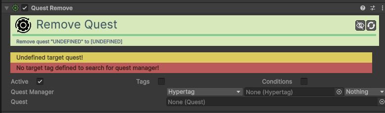

# Action-Quest-Remove

[:material-code-tags: Ver Código Fonte C#](https://github.com/VideojogosLusofona/OkapiKit/blob/main/Assets/OkapiKit/Scripts/Actions/ActionQuestRemove.cs){ .md-button }

Elimina uma missão da lista do jogador, sem a marcar como concluída ou falhada.

## Configurações do Inspector

| Campo | Função | Detalhes |
| :--- | :--- | :--- |
| **Active** | Ativação | Define se o componente está ligado e pronto para funcionar. |
| **Tags** | Etiquetas | Etiquetas inteligentes (Hypertags) usadas para identificação e filtros. |
| **Conditions** | Condições | Lista de requisitos (ex: variáveis ou tokens) que têm de ser verdadeiros para a execução. |
| **Quest Manager** | Gestor. | O componente que gere as missões. |
| **Quest** | Missão. | O recurso da missão (Quest Asset) que deve ser removida do log. |

## Como configurar

1. **Use**: para remover missões secundárias que tenham um limite de tempo ou que se tornem impossíveis por outras razões narrativas.

