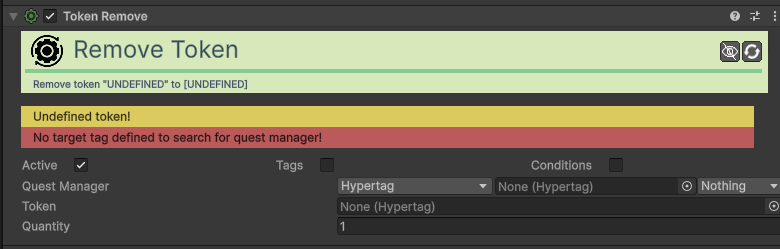

# Action-Token-Remove

[:material-code-tags: Ver Código Fonte C#](https://github.com/VideojogosLusofona/OkapiKit/blob/main/Assets/OkapiKit/Scripts/Actions/ActionTokenRemove.cs){ .md-button }

Retira tokens do inventário do jogador.

## Configurações do Inspector

| Campo | Função | Detalhes |
| :--- | :--- | :--- |
| **Active** | Ativação | Define se o componente está ligado e pronto para funcionar. |
| **Tags** | Etiquetas | Etiquetas inteligentes (Hypertags) usadas para identificação e filtros. |
| **Conditions** | Condições | Lista de requisitos (ex: variáveis ou tokens) que têm de ser verdadeiros para a execução. |
| **Quest Manager** | Gestor. | O componente que controla os tokens. |
| **Token** | Tipo de Token. | O item (Hypertag) a ser removido. |
| **Quantity** | Quantidade. | Quantos tokens retirar. |

## Como configurar

1. **Use**: quando o jogador abre uma porta que consome uma chave, ou quando paga a um NPC para obter uma informação.

