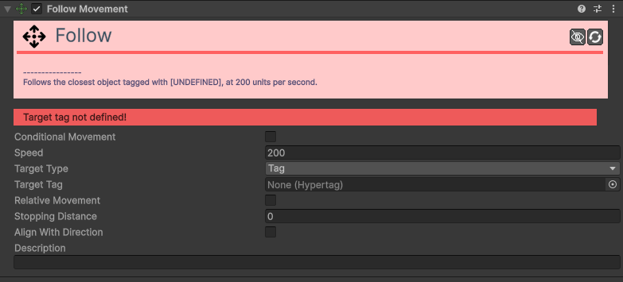

# Movement-Follow 

[:material-code-tags: Ver Código Fonte C#](https://github.com/VideojogosLusofona/OkapiKit/blob/main/Assets/OkapiKit/Scripts/Movement/MovementFollow.cs){ .md-button }

O componente **Follow Movement** faz com que o objeto persiga continuamente um alvo específico, que pode ser um objeto da Unity, um objeto com uma etiqueta (**Hypertag**) ou o ponteiro do rato.

## Configurações do Inspector

| Campo | Descrição | Detalhes |
| :--- | :--- | :--- |
| **Active** | Ativação | Define se o componente está ligado e pronto para funcionar. |
| **Tags** | Etiquetas | Etiquetas inteligentes (Hypertags) usadas para identificação e filtros. |
| **Conditions** | Condições | Lista de requisitos (ex: variáveis ou tokens) que têm de ser verdadeiros para a execução. |
| **Conditional Movement** | Ativa o movimento condicional. | Se ativado, este movimento só afetará o objeto se as condições definidas forem cumpridas. |
| **Conditions** | Condições de ativação. | Visível apenas se `Conditional Movement` estiver ativo. |
| **Speed** | Velocidade máxima. | Rapidez de deslocação em pixéis por segundo. |
| **Target Type** | Tipo de Alvo. | **Tag**: Segue o objeto mais próximo com a etiqueta definida. **Object**: Segue um objeto ligado diretamente. **Mouse**: Segue o cursor do rato. |
| **Target Tag** | Etiqueta do Alvo. | Visível se o tipo for **Tag**. Define qual a Hypertag a perseguir. |
| **Target Object** | Objeto Alvo. | Visível se o tipo for **Object**. Arraste o objeto para aqui. |
| **Camera Tag / Object**| Câmara. | Visível se o tipo for **Mouse**. Necessário para converter a posição do rato no ecrã para o mundo do jogo. |
| **Relative Movement** | Movimento Relativo. | Se ativo, o objeto preservará a distância e ângulo iniciais em relação ao alvo (útil para formação de equipas). |
| **Stopping Distance** | Distância de Paragem. | Distância mínima ao alvo para o objeto parar de se mover. |
| **Align With Direction** | Alinhar com a Direção. | Se ativo, o objeto rodará automaticamente para apontar na direção do movimento. |
| **Alignment Axis** | Eixo de Alinhamento. | Define se a "frente" do objeto é o seu eixo **Right** ou **Up**. |
| **Max Rotation Speed** | Vel. Rotação Máxima. | Rapidez máxima de rotação suave em graus por segundo. |
| **Description** | Notas do utilizador. | Campo para anotações internas. |

## Como configurar

1. **Adicione**: o componente **Follow Movement** ao objeto (ex: um Inimigo).

2. **Configure**: a **Speed** (ex: 200).

3. **Em**: **Target Type**, escolha **Tag** e defina a etiqueta como `Player`.

4. **Defina**: a **Stopping Distance** (ex: 50) para evitar que o inimigo fique exatamente em cima do jogador.

5. **Ative**: **Align With Direction** se quiser que o inimigo rode para "olhar" para o jogador enquanto o persegue.

