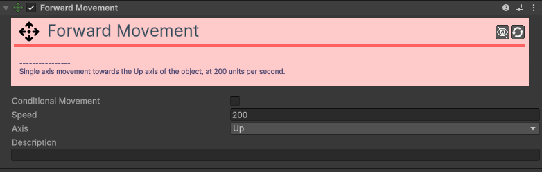

# Movement-Forward 

[:material-code-tags: Ver Código Fonte C#](https://github.com/VideojogosLusofona/OkapiKit/blob/main/Assets/OkapiKit/Scripts/Movement/MovementForward.cs){ .md-button }

Este componente faz com que o objeto se mova continuamente na sua direção "frente". É ideal para projéteis, como balas ou flechas, que se movem em linha reta assim que são criados.

## Configurações do Inspector

| Campo | Descrição | Detalhes |
| :--- | :--- | :--- |
| **Active** | Ativação | Define se o componente está ligado e pronto para funcionar. |
| **Tags** | Etiquetas | Etiquetas inteligentes (Hypertags) usadas para identificação e filtros. |
| **Conditions** | Condições | Lista de requisitos (ex: variáveis ou tokens) que têm de ser verdadeiros para a execução. |
| **Conditional Movement** | Ativa o movimento condicional. | Se ativado, este movimento só afetará o objeto se as condições definidas forem cumpridas. |
| **Conditions** | Condições de ativação. | Visível apenas se `Conditional Movement` estiver ativo. Define os requisitos (ex: premir uma tecla, valor de uma variável) para o movimento ocorrer. |
| **Speed** | Velocidade de movimento. | Define a rapidez com que o objeto se desloca, em pixéis por segundo. |
| **Axis** | Eixo frontal. | Define qual o eixo do objeto que deve ser considerado a "frente": **Right** (Eixo X) ou **Up** (Eixo Y). |
| **Description** | Notas do utilizador. | Um campo de texto para adicionar notas ou descrições internas sobre a função deste componente no jogo. |

## Como configurar

1. **Adicione**: o componente **Forward Movement** ao objeto (ex: um prefab de uma bala).

2. **Configure**: a **Speed** desejada.

3. **Defina**: o **Axis** de acordo com a orientação do seu sprite (normalmente **Right** se o sprite estiver virado para a direita por defeito).

4. **Garanta**: que, ao criar o objeto (Spawn), ele tenha a rotação correta, pois ele seguirá sempre na direção para onde estiver a apontar.

5. **Pode**: ser combinado com o componente `Action Destroy Object` num `Trigger On Collision` para destruir o projétil ao atingir um alvo.

