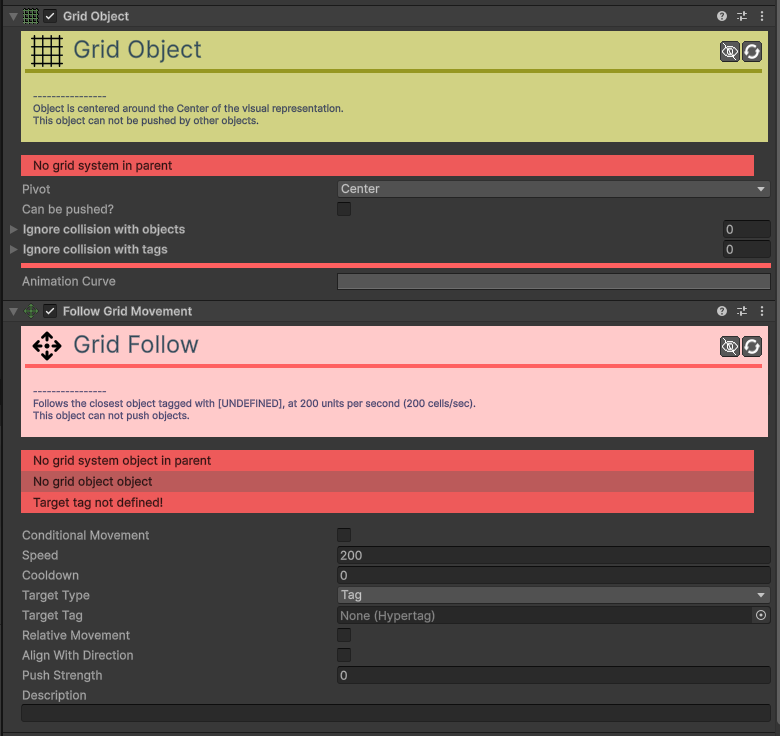

# Movement-Grid-Follow

[:material-code-tags: Ver Código Fonte C#](https://github.com/VideojogosLusofona/OkapiKit/blob/main/Assets/OkapiKit/Scripts/Movement/MovementGridFollow.cs){ .md-button }

Faz com que o objeto persiga um alvo movendo-se casa a casa numa grelha.

## Configurações do Inspector

| Campo | Função | Detalhes |
| :--- | :--- | :--- |
| **Active** | Ativação | Define se o componente está ligado e pronto para funcionar. |
| **Tags** | Etiquetas | Etiquetas inteligentes (Hypertags) usadas para identificação e filtros. |
| **Conditions** | Condições | Lista de requisitos (ex: variáveis ou tokens) que têm de ser verdadeiros para a execução. |
| **Speed** | Velocidade. | Rapidez de movimento entre células. |
| **Target Type**| Tipo de Alvo. | **Tag**, **Object** ou **Mouse**. |
| **Cooldown** | Cooldown. | Tempo de espera entre cada movimento de casa. |
| **Rotate Towards**| Orientação. | Roda para a direção do movimento na grelha. |

## Como configurar

1. **Requer**: um `Grid Object` no mesmo objeto e um `Grid System` na cena.

2. **Configure**: o alvo no campo **Target Tag** ou **Target Object**.

3. **É**: útil para inimigos em jogos estilo RPG clássico ou estratégia.

