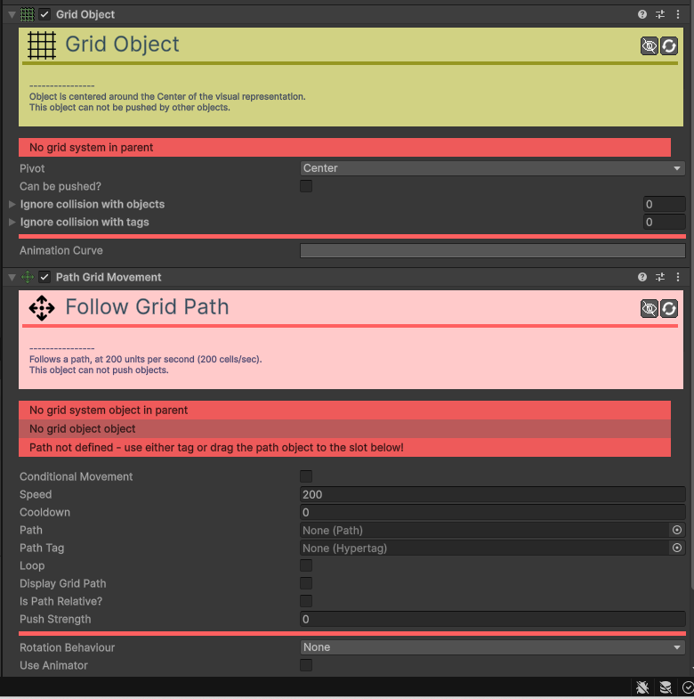

# Movement-Grid-Path

[:material-code-tags: Ver Código Fonte C#](https://github.com/VideojogosLusofona/OkapiKit/blob/main/Assets/OkapiKit/Scripts/Movement/MovementGridPath.cs){ .md-button }

Faz com que o objeto siga um caminho pré-definido (Path) movendo-se casa a casa.

## Configurações do Inspector

| Campo | Função | Detalhes |
| :--- | :--- | :--- |
| **Active** | Ativação | Define se o componente está ligado e pronto para funcionar. |
| **Tags** | Etiquetas | Etiquetas inteligentes (Hypertags) usadas para identificação e filtros. |
| **Conditions** | Condições | Lista de requisitos (ex: variáveis ou tokens) que têm de ser verdadeiros para a execução. |
| **Speed** | Velocidade. | Rapidez de movimento entre células. |
| **Path** | Caminho. | O objeto `Path` que define a trajetória. |
| **Loop** | Repetir. | Se deve voltar ao início ao terminar o caminho. |
| **Cooldown** | Cooldown. | Tempo de espera entre cada movimento. |

## Como configurar

1. **Requer**: um `Grid Object` e um `Grid System`.

2. **Arraste**: um objeto com o componente `Path` para o campo respetivo.

3. **O**: objeto irá saltar de célula em célula tentando seguir os pontos do caminho.

