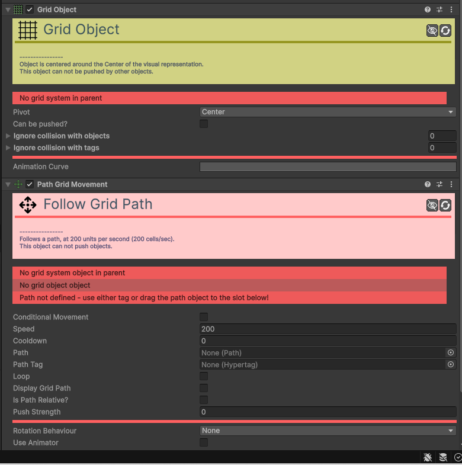

# Movement-Path

[:material-code-tags: Ver Código Fonte C#](https://github.com/VideojogosLusofona/OkapiKit/blob/main/Assets/OkapiKit/Scripts/Movement/MovementPath.cs){ .md-button }

Faz com que o objeto siga uma trajetória pré-definida.

## Configurações do Inspector

| Campo | Função | Detalhes |
| :--- | :--- | :--- |
| **Active** | Ativação | Define se o componente está ligado e pronto para funcionar. |
| **Tags** | Etiquetas | Etiquetas inteligentes (Hypertags) usadas para identificação e filtros. |
| **Conditions** | Condições | Lista de requisitos (ex: variáveis ou tokens) que têm de ser verdadeiros para a execução. |
| **Path** | Caminho. | Referência ao objeto `Path` a seguir. |
| **Speed / Duration**| Velocidade. | Define se o objeto segue a uma velocidade fixa ou se demora um tempo fixo a percorrer o caminho. |
| **Loop** | Repetir. | Se ativo, o objeto volta ao início quando chegar ao fim do caminho. |
| **Rel. / Abs.** | Relativo. | **Relative**: O caminho começa na posição atual do objeto. **Absolute**: O objeto teletransporta-se para o início do caminho. |
| **Rot. Behaviour** | Orientação. | Define se o objeto roda para alinhar com o caminho (**Align X** ou **Align Y**). |

## Como configurar

1. **Crie**: primeiro um objeto com o componente `Path` na sua cena e desenhe os pontos do caminho.

2. **No**: objeto que se vai mover, adicione o `Movement Path` e arraste o caminho criado para o campo **Path**.

3. **Se**: quiser que o objeto aponte para onde vai, mude o **Rotation Behaviour**.

