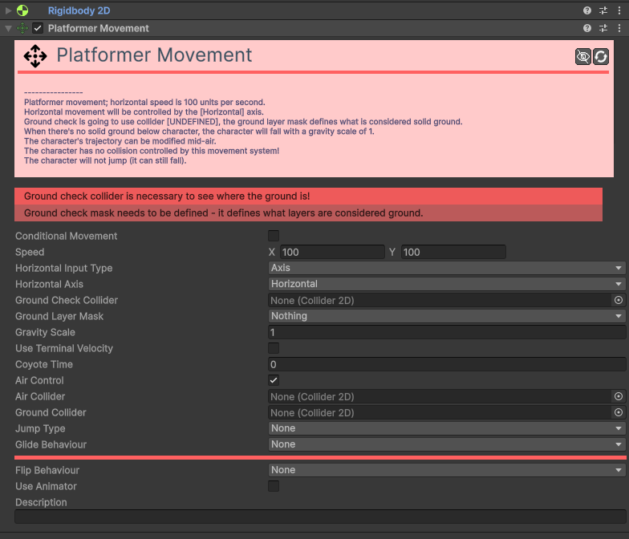

# Movement-Platformer 

[:material-code-tags: Ver Código Fonte C#](https://github.com/VideojogosLusofona/OkapiKit/blob/main/Assets/OkapiKit/Scripts/Movement/MovementPlatformer.cs){ .md-button }

O componente **Platformer Movement** é um dos mais robustos do OkapiKit, permitindo criar mecânicas completas de plataformas 2D com saltos, gravidade, inércia, "coyote time" e até planar.

## Configurações do Inspector

| Campo | Descrição | Detalhes |
| :--- | :--- | :--- |
| **Active** | Ativação | Define se o componente está ligado e pronto para funcionar. |
| **Tags** | Etiquetas | Etiquetas inteligentes (Hypertags) usadas para identificação e filtros. |
| **Conditions** | Condições | Lista de requisitos (ex: variáveis ou tokens) que têm de ser verdadeiros para a execução. |
| **Conditional Movement** | Ativa o movimento condicional. | Se ativado, este movimento só afetará o objeto se as condições definidas forem cumpridas. |
| **Conditions** | Condições de ativação. | Visível apenas se `Conditional Movement` estiver ativo. |
| **Speed** | Velocidade e Salto. | **X**: Velocidade horizontal máxima. **Y**: Força inicial do salto. |
| **Horizontal Input Type**| Controlo Horizontal. | Método de input: **Axis**, **Button** ou **Key**. |
| **Ground Check Collider**| Detetor de Chão. | Link para um colisor (círculo ou caixa) no fundo do personagem que deteta se ele está a tocar no chão. |
| **Ground Layer Mask** | Camada do Chão. | Define quais as camadas (Layers) que o componente deve considerar como superfícies sólidas. |
| **Gravity Scale** | Escala de Gravidade. | Define o peso do personagem. Multiplica a gravidade global do projeto. |
| **Use Terminal Velocity**| Velocidade Máxima. | Se ativo, limita a velocidade máxima de queda. |
| **Terminal Velocity** | Vel. Máx. Queda. | O valor máximo da velocidade de queda em pixéis/segundo. |
| **Coyote Time** | Tolerância de Queda. | Tempo (segundos) durante o qual o jogador ainda pode saltar após sair de uma plataforma. |
| **Air Control** | Controlo no Ar. | Se ativo, o jogador pode mudar de direção enquanto salta ou cai. |
| **Air Collider** | Colisor de Ar. | Colisor usado quando o personagem não está no chão. |
| **Ground Collider** | Colisor de Chão. | Colisor usado quando o personagem está no chão. |
| **Jump Type** | Tipo de Salto. | **None**: Não salta. **Fixed**: Salto sempre igual. **Variable**: Altura depende de quanto tempo a tecla é premida. |
| **Jump Input Type** | Controlo de Salto. | Método de input para o salto. |
| **Max Jump Count** | Número de Saltos. | Define se o jogador pode fazer saltos duplos, triplos, etc. (ex: 2 para salto duplo). |
| **Jump Buffering Time**| Janela de Salto. | Se o jogador premir saltar pouco antes de tocar no chão, o salto será executado assim que aterrar. |
| **Jump Max. Hold Time**| Tempo de Salto Variável.| Tempo máximo que o jogador pode segurar a tecla para aumentar a altura do salto (no modo Variable). |
| **Glide Behaviour** | Comportamento Planar. | **None**: Não plana. **Enabled**: Plana livremente. **Timer**: Tem um tempo limite para planar. |
| **Glide Input Type** | Controlo Planar. | Método de input para planar (normalmente o mesmo do salto ou um dedicado). |
| **Glide Max. Time** | Tempo Máx. Planar. | Visível no modo **Timer**. |
| **Max Glide Speed** | Velocidade ao Planar. | Velocidade máxima de descida enquanto plana (normalmente lenta). |
| **Flip Behaviour** | Inversão de Sprite. | Como o sprite deve reagir ao mudar de direção (ex: inverter escala X). |
| **Use Animator** | Usar Animador. | Se ativo, envia dados (IsGrounded, Velocity, etc.) para um Animador. |
| **Animator** | Componente Animador. | Referência ao `Animator`. |
| **Description** | Notas do utilizador. | Campo para anotações internas. |

## Como configurar

1. **Adicione**: o componente **Platformer Movement** ao personagem.

2. **Certifique-se**: de que o personagem tem um **Rigidbody 2D** (configurado como Dynamic) e um **Collider 2D**.

3. **Crie**: um objeto filho com um pequeno colisor no fundo e arraste-o para o campo **Ground Check Collider**.

4. **Defina**: a **Ground Layer Mask** para incluir a camada das suas plataformas.

5. **Configure**: a **Speed** (X para correr, Y para a força do salto).

6. **Ajuste**: a **Gravity Scale** (ex: 3 ou 4) para evitar movimentos que pareçam estar "na lua".

7. **(Opcional)**: Configure as variáveis do **Animator** para que as animações de correr e saltar funcionem automaticamente.

