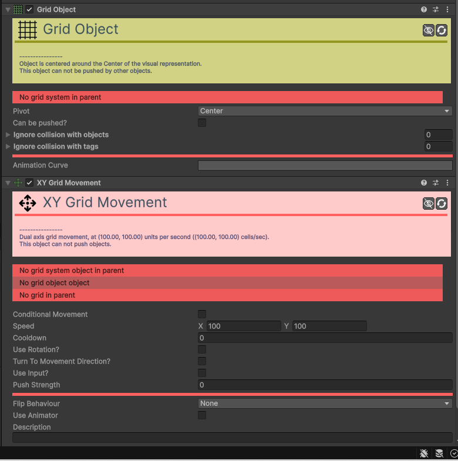

# Movement-XY 

[:material-code-tags: Ver Código Fonte C#](https://github.com/VideojogosLusofona/OkapiKit/blob/main/Assets/OkapiKit/Scripts/Movement/MovementXY.cs){ .md-button }

Este componente permite controlar o movimento de um objeto nos eixos X (horizontal) e Y (vertical). É ideal para jogos com perspetiva de cima (top-down), shooters de arena ou qualquer jogo onde o movimento não dependa de gravidade.

## Configurações do Inspector

| Campo | Descrição | Detalhes |
| :--- | :--- | :--- |
| **Active** | Ativação | Define se o componente está ligado e pronto para funcionar. |
| **Tags** | Etiquetas | Etiquetas inteligentes (Hypertags) usadas para identificação e filtros. |
| **Conditions** | Condições | Lista de requisitos (ex: variáveis ou tokens) que têm de ser verdadeiros para a execução. |
| **Conditional Movement** | Ativa o movimento condicional. | Se ativado, este movimento só afetará o objeto se as condições definidas forem cumpridas. |
| **Conditions** | Condições de ativação. | Visível apenas se `Conditional Movement` estiver ativo. Define os requisitos para o movimento ocorrer. |
| **Speed** | Velocidade máxima. | Rapidez máxima de deslocação em unidades do mundo (pixéis) por segundo. |
| **Limit Speed?** | Limitar velocidade? | Se ativo, limita a velocidade total em movimentos diagonais para que o objeto não se mova mais depressa quando caminha na diagonal. |
| **Maximum Speed** | Velocidade Máxima Absoluta. | Visível apenas se `Limit Speed?` estiver ativo. Define o limite de velocidade para todas as direções. |
| **Use Rotation?** | Usar Rotação? | Se ativo, as velocidades X e Y são relativas à rotação do objeto (local), e não ao ecrã (global). |
| **Turn To Movement Direction?** | Virar para a Direção? | Se ativo, o objeto rodará automaticamente para apontar na direção em que se está a mover. |
| **Axis to align** | Eixo a alinhar. | Define se o objeto aponta para a "frente" com o seu eixo **Right** ou **Up**. |
| **Max turn speed** | Vel. rotação máx. | Velocidade máxima de rotação suave em graus por segundo. |
| **Use Input?** | Usar Input? | Define se o movimento é controlado pelo jogador. |
| **Use Inertia?** | Usar Inércia? | Se ativo, o objeto demora algum tempo a ganhar e a perder velocidade (aceleração/desaceleração). |
| **Stop Time** | Tempo de paragem. | Tempo que o objeto demora a parar completamente após soltar o comando. |
| **Input Type** | Tipo de Input. | Escolha o método de controlo: **Axis**, **Button** ou **Key**. |
| **Flip Behaviour** | Comportamento de Inversão. | Define como o sprite deve reagir visualmente ao mudar de direção (ex: inverter horizontalmente). |
| **Use Animator** | Usar Animador. | Se ativo, este componente enviará dados de velocidade para um `Animator` da Unity. |
| **Animator** | Animador. | Referência ao componente `Animator` a controlar. |
| **Description** | Notas do utilizador. | Campo de texto para notas internas. |

## Como configurar

1. **Adicione**: o componente **XY Movement** ao objeto do jogador.

2. **Configure**: a **Speed** (ex: 300).

3. **Ative**: **Use Input?** para permitir o controlo pelo jogador.

4. **Escolha**: o **Input Type** (ex: **Key**) e configure as teclas para as direções (Cima, Baixo, Esquerda, Direita).

5. **Se**: o seu jogo for top-down, pode ativar **Turn To Movement Direction?** para que o personagem olhe para onde caminha.

6. **Se**: quiser um movimento mais fluido, ative **Use Inertia?**.

