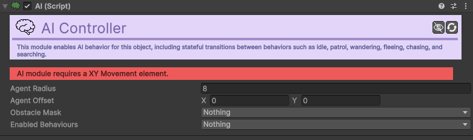

# AI

[:material-code-tags: Ver Código Fonte C#](https://github.com/VideojogosLusofona/OkapiKit/blob/main/Assets/OkapiKit/Scripts/Systems/AI.cs){ .md-button }

O motor de Inteligência Artificial do OkapiKit. Gere estados complexos de movimento e decisão para NPCs e inimigos.

## Configurações do Inspector

### Configurações de Base
| Campo | Função | Detalhes |
| :--- | :--- | :--- |
| **Active** | Ativação | Define se o componente está ligado e pronto para funcionar. |
| **Tags** | Etiquetas | Etiquetas inteligentes (Hypertags) usadas para identificação e filtros. |
| **Conditions** | Condições | Lista de requisitos (ex: variáveis ou tokens) que têm de ser verdadeiros para a execução. |
| **Agent-Radius** | Tamanho | Raio de colisão virtual para evitar paredes. |
| **Agent-Offset** | Posição | Desvio do centro do agente. |
| **Flags** | Comportamentos| Ativa **Wander**, **Flee**, **Chase**, **Search** ou **Patrol**. |
| **Obstacle-Mask** | Colisões | Camadas que a IA interpreta como bloqueios físicos. |

### Configurações de Estado
| Estado | Campos Chave | Detalhes |
| :--- | :--- | :--- |
| **Wander** | **Wander-Radius**, **Time-Between-Wanders** | Define a área e calma do movimento aleatório. |
| **Chase** | **Chase-Tags**, **Chase-View-Distance**, **Chase-Stop-Distance** | Define quem perseguir e quão perto chegar. |
| **Flee** | **Flee-Tags**, **Flee-Proximity-Radius** | Define de quem fugir e a que distância. |
| **Search** | **Search-Radius**, **Search-Max-Time** | O que fazer quando o alvo perseguido desaparece. |
| **Patrol** | **Patrol-Path**, **Patrol-Mode** | Seguir um caminho predefinido ou pontos de patrulha. |

## Como configurar

1. **Movimento**: O componente AI precisa de um componente de **Movement** (ex: Movement-XY ou Movement-Platformer) no mesmo objeto para funcionar.

2. **Obstáculos**: Configure a **Obstacle-Mask** (ex: Layer "Default" ou "Environment") para que a IA não tente atravessar paredes.

3. **Sensores**:

   * Para **Chase** (Perseguir), adicione as Tags do alvo (ex: "Player").
   * Ajuste o **Chase-View-Distance** para definir o "olhar" do inimigo.
4. **Patrol**: Se usar Patrulha, arraste um objeto com o componente **Path** para o campo **Patrol-Path**.

