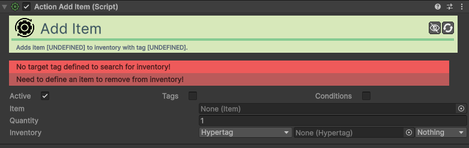

# Action-Add-Item

[:material-code-tags: Ver Código Fonte C#](https://github.com/VideojogosLusofona/OkapiKit/blob/main/Assets/OkapiKit/Scripts/Actions/ActionAddItem.cs){ .md-button }

Adiciona um item específico ao inventário do jogador ou de outro objeto.

## Configurações do Inspector

| Campo | Função | Detalhes |
| :--- | :--- | :--- |
| **Active** | Ativação | Define se o componente está ligado e pronto para funcionar. |
| **Tags** | Etiquetas | Etiquetas inteligentes (Hypertags) usadas para identificação e filtros. |
| **Conditions** | Condições | Lista de requisitos (ex: variáveis ou tokens) que têm de ser verdadeiros para a execução. |
| **Item** | Item | Referência ao asset de **Item** (Scriptable-Object) a adicionar. |
| **Quantity** | Quantidade | O número de unidades do item a adicionar. |
| **Inventory** | Inventário | O alvo onde o item será colocado (via Hyper-Tag ou Objeto). |

## Como configurar

1. **Definir Item**: No Unity, arraste o item que criou (Data Object) para o campo **Item**.

2. **Quantidade**: Defina o número de unidades que serão entregues ao jogador.

3. **Alvo**: Configure o **Inventory** para apontar para o inventário correto (geralmente usando a Hyper-Tag "Player").

4. **Trigger**: Esta ação é comumente usada com um trigger **On-Collision** quando o jogador "apanha" um item no mundo.

