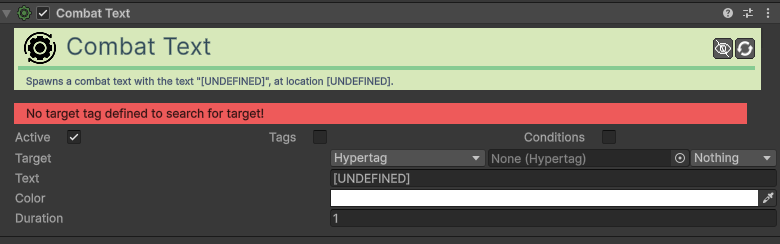

# Action-Combat-Text

[:material-code-tags: Ver Código Fonte C#](https://github.com/VideojogosLusofona/OkapiKit/blob/main/Assets/OkapiKit/Scripts/Actions/ActionCombatText.cs){ .md-button }

Cria um texto flutuante no ecrã para notificações rápidas, como números de dano, curas ou nomes de itens obtidos.

## Configurações do Inspector

| Campo | Função | Detalhes |
| :--- | :--- | :--- |
| **Active** | Ativação | Define se o componente está ligado e pronto para funcionar. |
| **Tags** | Etiquetas | Etiquetas inteligentes (Hypertags) usadas para identificação e filtros. |
| **Conditions** | Condições | Lista de requisitos (ex: variáveis ou tokens) que têm de ser verdadeiros para a execução. |
| **Target-Transform** | Origem | A localização onde o texto vai "nascer" (Self, Path, etc.). |
| **Text** | Mensagem | O conteúdo textual a exibir. |
| **Color** | Cor | A cor final do texto no ecrã. |
| **Duration** | Tempo | Quanto tempo o texto flutua antes de desaparecer. |

## Como configurar

1. **Gestor**: Certifique-se de que tem um **Combat-Text-Manager** na sua cena (habitualmente no objeto "GameManager").

2. **Posição**: Configure o **Target-Transform** para o objeto que está a sofrer a ação. Se o objeto tiver um **Combat-Text-Pivot**, o texto aparecerá nesse ponto.

3. **Trigger**: Associe esta ação a um trigger (ex: **On-Collision** ou **On-Resource-Empty**) para dar feedback imediato ao jogador.

