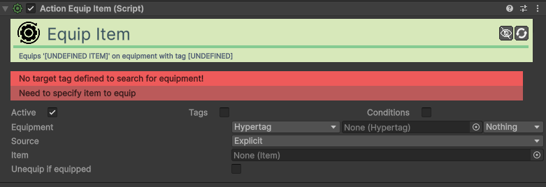

# Action-Equip-Item

[:material-code-tags: Ver Código Fonte C#](https://github.com/VideojogosLusofona/OkapiKit/blob/main/Assets/OkapiKit/Scripts/Actions/ActionEquipItem.cs){ .md-button }

Equipa um item num personagem através do sistema de equipamento.

## Configurações do Inspector

| Campo | Função | Detalhes |
| :--- | :--- | :--- |
| **Active** | Ativação | Define se o componente está ligado e pronto para funcionar. |
| **Tags** | Etiquetas | Etiquetas inteligentes (Hypertags) usadas para identificação e filtros. |
| **Conditions** | Condições | Lista de requisitos (ex: variáveis ou tokens) que têm de ser verdadeiros para a execução. |
| **Equipment** | Sistema | O componente de equipamento alvo. |
| **Item-Source** | Origem | Escolha entre **Explicit** (definido aqui), **Inventory-Item** (procura no inventário) ou **Inventory-Slot**. |
| **Item** | Item | O item a equipar (para modos **Explicit** ou **Inventory-Item**). |
| **Inventory** | Inventário | Inventário a consultar (para modos **Inventory-Item** ou **Slot**). |
| **Inventory-Slot** | Slot | Índice do slot a equipar (usado se modo for **Slot**). |
| **Unequip-If-Equipped**| Alternar | Se o item já estiver equipado, será desequipado ao ativar a ação. |

## Como configurar

1. **Slots**: Garanta que o personagem alvo tem um componente **Equipment** com os slots (Hyper-Tags) configurados corretamente.

2. **Atendimento**: Se usar **Inventory-Item**, garanta que o item existe no inventário, caso contrário a ação falhará.

3. **Trigger**: Use esta ação em botões de inventário ou ao interagir com objetos que devem ser equipados automaticamente.

