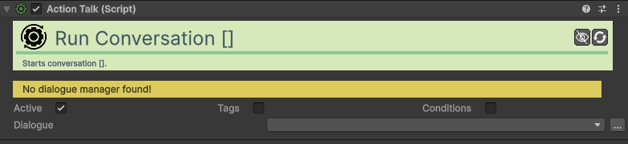

# Action-Talk

[:material-code-tags: Ver Código Fonte C#](https://github.com/VideojogosLusofona/OkapiKit/blob/main/Assets/OkapiKit/Scripts/Actions/ActionTalk.cs){ .md-button }

Inicia uma conversa específica gerida pelo Dialogue-Manager.

## Configurações do Inspector

| Campo | Função | Detalhes |
| :--- | :--- | :--- |
| **Active** | Ativação | Define se o componente está ligado e pronto para funcionar. |
| **Tags** | Etiquetas | Etiquetas inteligentes (Hypertags) usadas para identificação e filtros. |
| **Conditions** | Condições | Lista de requisitos (ex: variáveis ou tokens) que têm de ser verdadeiros para a execução. |
| **Dialogue-Key** | Identificador | O nome único da conversa presente nos ficheiros de **Dialogue-Data**. |

## Como configurar

1. **Dialogue Manager**: Certifique-se de que existe um gestor de diálogos na cena e que o mesmo contém o ficheiro de dados com a chave desejada.

2. **Ativação**: Associe esta ação a um trigger (ex: **On-Input** ou **On-Collision**) para iniciar a conversa.

3. **Pausa**: O Dialogue-Manager pode ser configurado para pausar o jogo enquanto a conversa decorre.

