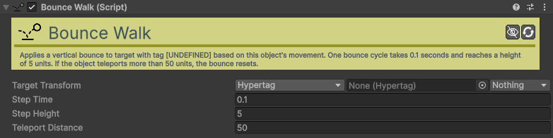

# Bounce-Walk

[:material-code-tags: Ver Código Fonte C#](https://github.com/VideojogosLusofona/OkapiKit/blob/main/Assets/OkapiKit/Scripts/Helpers/BounceWalk.cs){ .md-button }

Adiciona um efeito visual de caminhar aos saltos a um objeto enquanto este se move.

## Configurações do Inspector

| Campo | Função | Detalhes |
| :--- | :--- | :--- |
| **Active** | Ativação | Define se o componente está ligado e pronto para funcionar. |
| **Tags** | Etiquetas | Etiquetas inteligentes (Hypertags) usadas para identificação e filtros. |
| **Conditions** | Condições | Lista de requisitos (ex: variáveis ou tokens) que têm de ser verdadeiros para a execução. |
| **Target** | Alvo | O Transform que será animado (geralmente o visual do objeto). |
| **Step-Time** | Ritmo | Tempo de duração de cada "passo" do salto. |
| **Step-Height** | Altura | Quão alto o objeto salta em cada passo. |
| **Teleport-Dist** | Limite | Se o objeto se mover mais que esta distância instantaneamente, o efeito reinicia. |

## Como configurar

1. **Alvo Visual**: No campo **Target**, arraste o objeto filho que contém o gráfico/sprite do seu personagem.

2. **Ajuste Fino**: Teste o valor de **Step-Height** para evitar saltos exagerados. Um valor entre 0.1 e 0.5 costuma ser o ideal para sprites pequenos.

3. **Condição**: O efeito só é visível enquanto o objeto principal se desloca no mundo. Quando o objeto para, o visual regressa suavemente à posição base.

