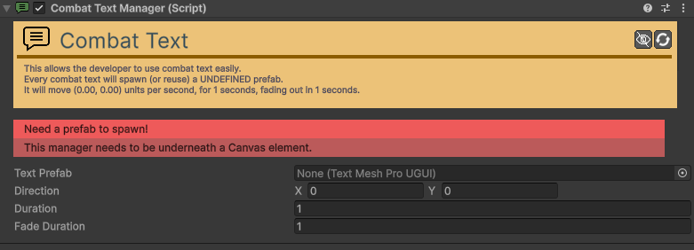

# Combat-Text-Manager

[:material-code-tags: Ver Código Fonte C#](https://github.com/VideojogosLusofona/OkapiKit/blob/main/Assets/OkapiKit/Scripts/Systems/CombatTextManager.cs){ .md-button }

Gestor global que controla a criação e animação de todos os textos de combate e notificações flutuantes.

## Configurações do Inspector

| Campo | Função | Detalhes |
| :--- | :--- | :--- |
| **Active** | Ativação | Define se o componente está ligado e pronto para funcionar. |
| **Tags** | Etiquetas | Etiquetas inteligentes (Hypertags) usadas para identificação e filtros. |
| **Conditions** | Condições | Lista de requisitos (ex: variáveis ou tokens) que têm de ser verdadeiros para a execução. |
| **Text-Prefab** | Prefab | O objeto de UI (TextMeshPro-Text) que será usado como base para as mensagens. |
| **Default-Time** | Tempo Padrão | Duração de exibição se não for especificada na ação. |
| **Movement-Vector** | Direção | Vetor de movimento para onde os textos flutuam após nascerem. |
| **Fade-Rate** | Desvanecer | Velocidade com que o texto desaparece do ecrã. |

## Como configurar

1. **Localização**: Adicione este componente a um objeto central na cena (ex: "UIManager") ou ao prefab GameManager.

2. **Prefab**: Crie um prefab de UI simples que contenha o componente **TextMeshPro - Text (UI)** e arraste-o para o campo **Text-Prefab**.

3. **Automatização**: Vários outros sistemas (Quest-Manager, Inventory, Resource) utilizam este gestor automaticamente se ele estiver presente na cena.

