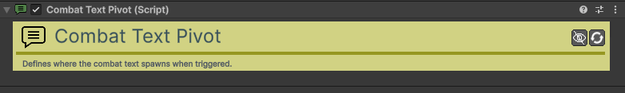

# Combat-Text-Pivot

[:material-code-tags: Ver Código Fonte C#](https://github.com/VideojogosLusofona/OkapiKit/blob/main/Assets/OkapiKit/Scripts/Systems/CombatTextPivot.cs){ .md-button }

Define o local exato onde o texto de combate (danos, curas, notificações) deve aparecer num objeto.

## Configurações do Inspector

Este componente não possui propriedades configuráveis no Inspector. A sua simples presença no objeto (ou num filho do objeto) indica ao sistema que aquele Transform deve ser usado como o ponto de origem das mensagens flutuantes.

## Como configurar

1. **Adicionar ao Objeto**: No Prefab do seu inimigo ou jogador, adicione o componente **Combat-Text-Pivot**.

2. **Posicionamento**: Na janela Scene, mova o objeto com o Pivot para cima da cabeça do personagem (ou onde preferir que as notificações apareçam).

3. **Uso Automático**: Quando usar ações ou sistemas (como **Resource**) que disparem **Combat-Text**, o OkapiKit irá procurar automaticamente por este Pivot para posicionar o texto.

