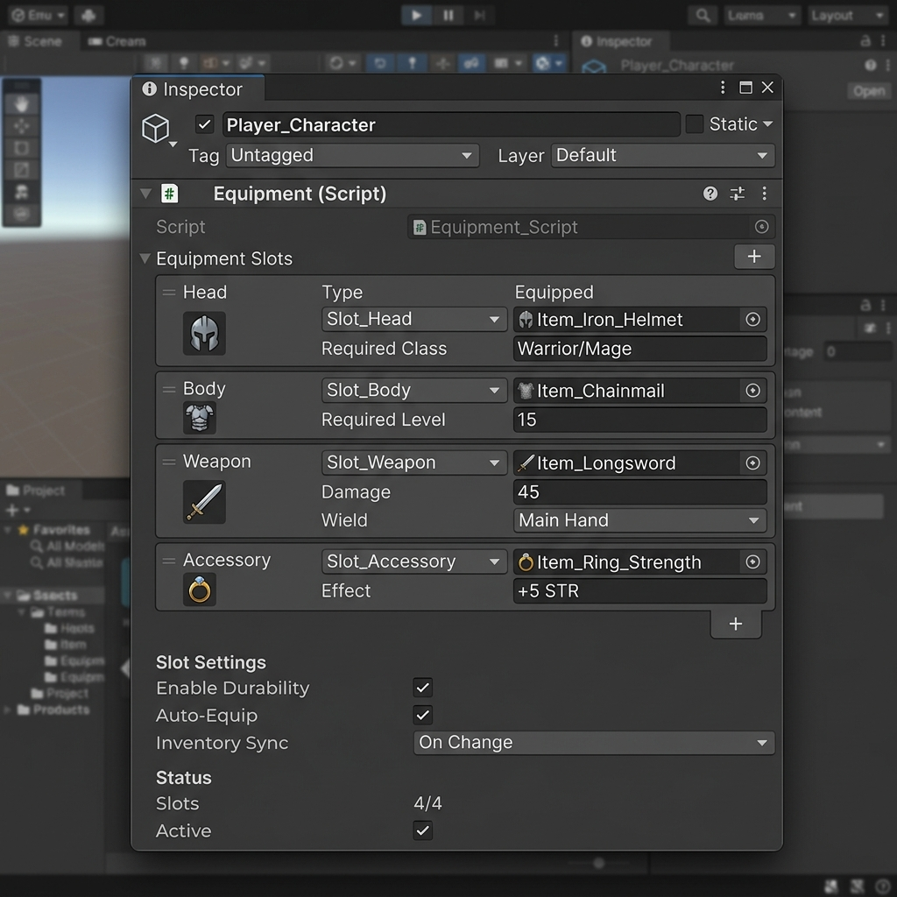

# Equipment

[:material-code-tags: Ver Código Fonte C#](https://github.com/VideojogosLusofona/OkapiKit/blob/main/Assets/OkapiKit/Scripts/Systems/Equipment.cs){ .md-button }

Sistema para gerir slots de equipamento (ex: Cabeça, Peito, Arma) e as respetivas estatísticas.

## Configurações do Inspector

| Campo | Função | Detalhes |
| :--- | :--- | :--- |
| **Active** | Ativação | Define se o componente está ligado e pronto para funcionar. |
| **Tags** | Etiquetas | Etiquetas inteligentes (Hypertags) usadas para identificação e filtros. |
| **Conditions** | Condições | Lista de requisitos (ex: variáveis ou tokens) que têm de ser verdadeiros para a execução. |
| **Linked-Inventory** | Inventário | O inventário de onde os itens são retirados para serem equipados. |
| **Available-Slots** | Slots | Lista de Hyper-Tags que definem os espaços disponíveis (ex: "Head", "Weapon"). |
| **Combat-Text-En.** | Notificar | Ativa textos flutuantes ao equipar ou desequipar. |
| **Combat-Text-Dur.** | Duração | Tempo de exibição das mensagens de equipamento. |
| **Equipped-Color** | Cor Equipar | Cor do texto flutuante ao equipar um item. |
| **Unequipped-Color** | Cor Retirar | Cor do texto flutuante ao desequipar um item. |

## Como configurar

1. **Slots**: No campo **Available-Slots**, adicione Hyper-Tags para cada "lugar" no corpo do personagem.

2. **Ligar Inventário**: Defina qual o inventário que este sistema de equipamento deve monitorizar.

3. **Equipar via Ação**: Use a ação **Action-Equip-Item** num botão ou trigger para colocar um item do inventário num destes slots.

4. **Resumo Visual**: Use o componente **Item-Display** na sua UI, configurado para o modo **Equipment** e com a Hyper-Tag do slot correspondente, para mostrar o ícone do que está equipado.

