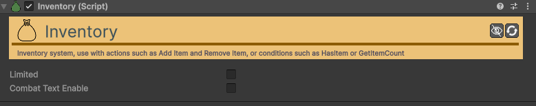

# Inventory

[:material-code-tags: Ver Código Fonte C#](https://github.com/VideojogosLusofona/OkapiKit/blob/main/Assets/OkapiKit/Scripts/Systems/Inventory.cs){ .md-button }

Sistema de armazenamento e gestão de coleções de itens baseado em assets Scriptable-Object.

## Configurações do Inspector

| Campo | Função | Detalhes |
| :--- | :--- | :--- |
| **Active** | Ativação | Define se o componente está ligado e pronto para funcionar. |
| **Tags** | Etiquetas | Etiquetas inteligentes (Hypertags) usadas para identificação e filtros. |
| **Conditions** | Condições | Lista de requisitos (ex: variáveis ou tokens) que têm de ser verdadeiros para a execução. |
| **Limited** | Limitar | Se ativo, o inventário terá um número máximo de slots. |
| **Max-Slots** | Capacidade | Quantidade máxima de itens diferentes que podem ser guardados. |
| **Combat-Text-En.** | Notificar | Ativa textos flutuantes automáticos ao ganhar ou perder itens. |
| **Combat-Text-Dur.** | Duração | Tempo que as mensagens de inventário ficam visíveis. |
| **Received-Color** | Cor Ganhar | Cor do texto flutuante ao receber um item. |
| **Lost-Color** | Cor Perder | Cor do texto flutuante ao remover um item. |

## Como configurar

1. **Objeto Alvo**: Adicione o componente **Inventory** ao seu objeto de jogador ou a um contentor persistente.

2. **Integração**: Use ações como **Action-Add-Item** ou **Action-Remove-Item** para modificar o conteúdo do inventário em tempo de execução.

3. **UI**: Para visualizar os itens, utilize componentes **Item-Display** na sua interface, ligando-os a este inventário.

4. **Verificação**: Utilize o **Trigger-On-Condition** para criar portas ou eventos que só se ativam se o jogador possuir um item específico.

