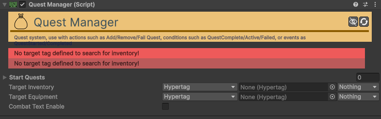

# Quest-Manager

[:material-code-tags: Ver Código Fonte C#](https://github.com/VideojogosLusofona/OkapiKit/blob/main/Assets/OkapiKit/Scripts/Systems/QuestManager.cs){ .md-button }

O cérebro que gere o estado de todas as missões, objetivos e tokens do jogo.

## Configurações do Inspector

| Campo | Função | Detalhes |
| :--- | :--- | :--- |
| **Active** | Ativação | Define se o componente está ligado e pronto para funcionar. |
| **Tags** | Etiquetas | Etiquetas inteligentes (Hypertags) usadas para identificação e filtros. |
| **Conditions** | Condições | Lista de requisitos (ex: variáveis ou tokens) que têm de ser verdadeiros para a execução. |
| **Start-Quests** | Ativas | Lista de missões que o jogador já tem ao iniciar a cena. |
| **Target-Inventory** | Inventário | O inventário onde o sistema verifica a posse de itens de missão. |
| **Target-Equipment** | Equipamento | O sistema de equipamento onde o sistema verifica itens equipados. |
| **Combat-Text-En.** | Notificar | Ativa textos flutuantes sobre o estado das missões. |
| **Combat-Text-Dur.** | Duração | Tempo de exibição dos avisos de missão. |
| **Active-Color** | Cor Início | Cor do texto ao iniciar uma nova missão. |
| **Completed-Color** | Cor Fim | Cor do texto ao completar um objetivo ou missão. |

## Como configurar

1. **Centralização**: Crie um objeto vazio chamado "QuestManager" (ou use um objeto persistente) e adicione este componente.

2. **Definir Missões**: Crie ativos do tipo **Quest** (Scriptable-Object) com os seus objetivos e adicione-os à lista **Start-Quests** se quiser que comecem logo.

3. **Sensores**: Associe o **Target-Inventory** do jogador para que missões do tipo "Coletar 10 Madeiras" funcionem automaticamente.

4. **Eventos**: Use o **Trigger-On-Quest-Event** em outros objetos para disparar ações (abrir portas, tocar música) quando uma missão for completada.

