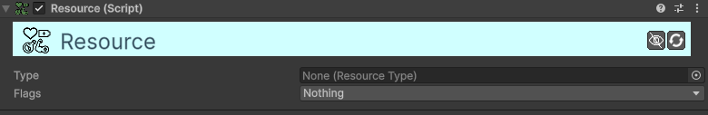

# Resource

[:material-code-tags: Ver Código Fonte C#](https://github.com/VideojogosLusofona/OkapiKit/blob/main/Assets/OkapiKit/Scripts/Systems/Resource.cs){ .md-button }

Gere valores numéricos dinâmicos com limites e suporte a notificações, ideal para sistemas de Vida, Mana ou Energia.

## Configurações do Inspector

| Campo | Função | Detalhes |
| :--- | :--- | :--- |
| **Active** | Ativação | Define se o componente está ligado e pronto para funcionar. |
| **Tags** | Etiquetas | Etiquetas inteligentes (Hypertags) usadas para identificação e filtros. |
| **Conditions** | Condições | Lista de requisitos (ex: variáveis ou tokens) que têm de ser verdadeiros para a execução. |
| **Type** | Definição | O asset de **Resource-Type** que contém a configuração de valor máximo. |
| **Flags** | Opções | **Global-Cooldown**, **Cooldown-Per-Source** e **Enable-Combat-Text**. |
| **Start-Value** | Inicial | O valor com que o recurso será iniciado automaticamente ao entrar na cena. |

## Como configurar

1. **Ativo de Dados**: Crie um **Resource-Type** no seu projeto (Botão direito -> OkapiKit -> Resource-Type) e defina nele o Valor Máximo.

2. **Adição**: Adicione o componente **Resource** ao seu objeto (ex: Jogador).

3. **Modificação**: Utilize a ação **Action-Change-Resource** em triggers para aumentar ou diminuir o valor em tempo de execução.

4. **Visibilidade**: Utilize o componente **Value-Display-Progress** para criar barras de vida que monitorizam este recurso automaticamente.

