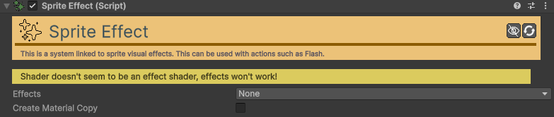

# Sprite-Effect

[:material-code-tags: Ver Código Fonte C#](https://github.com/VideojogosLusofona/OkapiKit/blob/main/Assets/OkapiKit/Scripts/Helpers/SpriteEffect.cs){ .md-button }

Uma ferramenta poderosa para aplicar efeitos visuais instantâneos (Outline, Flash, Inversão de Cores) em qualquer SpriteRenderer usando shaders otimizados.

## Configurações do Inspector

| Campo | Função | Detalhes |
| :--- | :--- | :--- |
| **Active** | Ativação | Define se o componente está ligado e pronto para funcionar. |
| **Tags** | Etiquetas | Etiquetas inteligentes (Hypertags) usadas para identificação e filtros. |
| **Conditions** | Condições | Lista de requisitos (ex: variáveis ou tokens) que têm de ser verdadeiros para a execução. |
| **Effects** | Ativação | Lista de efeitos ativos: **Color-Remap**, **Inverse**, **Color-Flash**, **Outline**. |
| **Palette** | Paleta | (Color-Remap) Troca as cores originais pelas cores presentes num ativo **Palette**. |
| **Inverse-Factor** | Inversão | (Inverse) Intensidade da inversão de cores (0 a 1). |
| **Flash-Color** | Flash | (Color-Flash) Define a cor e a força (alpha) do preenchimento sólido. |
| **Outline-Width** | Contorno | (Outline) Espessura da linha exterior em pixels. |
| **Outline-Color** | Cor Contorno | (Outline) Cor da linha exterior. |
| **Create-Mat-Copy** | Isolamento | Se verdadeiro, cria uma cópia única do material para evitar que o efeito afete outros objetos com o mesmo material. |

## Como configurar

1. **Shader**: Certifique-se de que o seu **SpriteRenderer** está a usar um material com um shader compatível com o OkapiKit (habitualmente incluído nos materiais do kit).

2. **Escolha de Efeitos**: Marque as caixas no campo **Effects** para revelar as opções específicas de cada um.

3. **Controlo**: Embora possa configurar valores estáticos, este componente brilha quando usado com a ação **Action-Flash** ou **Action-Set-Outline** para dar feedback visual de interação ou dano.

4. **Otimização**: Se tiver muitos inimigos iguais no ecrã e todos sofrerem o efeito ao mesmo tempo (ex: flash de dano), desative **Create-Mat-Copy** para poupar memória, mas note que todos piscarão em simultâneo.

