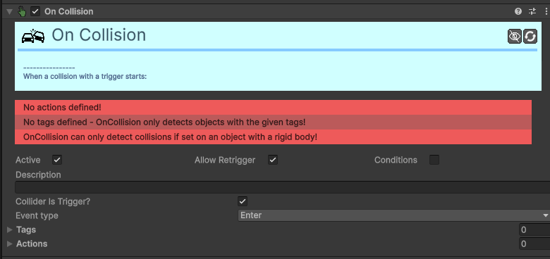

# Trigger-On-Collision 

[:material-code-tags: Ver Código Fonte C#](https://github.com/VideojogosLusofona/OkapiKit/blob/main/Assets/OkapiKit/Scripts/Triggers/TriggerOnCollision.cs){ .md-button }

Este componente deteta colisões entre o objeto atual e outros objetos. Quando uma colisão ocorre (cumprindo as regras de etiquetas e tipo), ele executa uma lista de ações sequenciais.

## Configurações do Inspector

| Campo | Descrição | Detalhes |
| :--- | :--- | :--- |
| **Active** | Ativação | Define se o componente está ligado e pronto para funcionar. |
| **Tags** | Etiquetas | Etiquetas inteligentes (Hypertags) usadas para identificação e filtros. |
| **Conditions** | Condições | Lista de requisitos (ex: variáveis ou tokens) que têm de ser verdadeiros para a execução. |
| **Active** | Ativa o trigger. | Se desativado, o objeto ignorará todas as colisões. |
| **Allow Retrigger** | Permitir repetição. | Se ativo, o trigger pode disparar várias vezes. Se desativado, dispara apenas uma vez e desliga-se. |
| **Conditions** | Ativa condições. | Permite definir requisitos adicionais para que o trigger dispare (ex: o jogador ter uma chave). |
| **Description** | Notas do utilizador. | Campo para anotações internas. |
| **Conditions** | Lista de condições. | Visível apenas se `Conditions` estiver ativo no topo. |
| **Collider Is Trigger?**| Colisor é Trigger? | Se ativo, o componente detetará apenas colisões com objetos cujos **Colliders** tenham a opção **Is Trigger** ativada. |
| **Event type** | Tipo de Evento. | **Enter**: Dispara no momento do impacto. **Stay**: Dispara enquanto os objetos estão a tocar. **Exit**: Dispara quando os objetos se separam. |
| **Tags** | Etiquetas válidas. | Lista de etiquetas (**Hypertags**) que podem ativar este trigger. O trigger ignorará colisões com objetos que não tenham estas etiquetas. |
| **Actions** | Lista de Ações. | Sequência de ações a serem executadas quando a colisão ocorre. Cada ação pode ter um atraso (**Delay**) específico. |

## Como configurar

1. **Adicione**: o componente **On Collision Trigger** ao seu objeto (ex: um Lobo).

2. **Certifique-se**: de que o objeto tem um **Collider 2D** e, idealmente, um **Rigidbody 2D**.

3. **Defina**: as **Tags** dos objetos que o Lobo deve detetar (ex: Player).

4. **Em**: **Actions**, arraste uma ou mais ações (ex: uma `Action Change Resource` para tirar vida ao jogador).

5. **Se**: quiser que o Lobo dê dano contínuo enquanto toca no jogador, mude o **Event type** para **Stay**.

