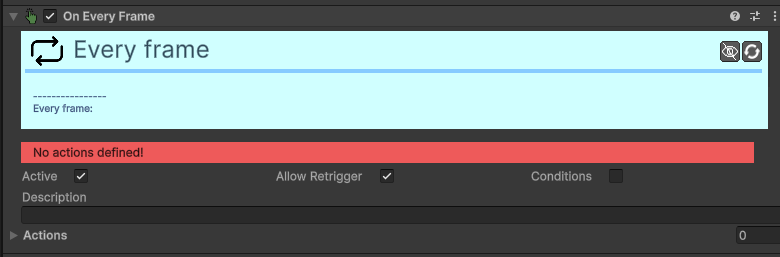

# Trigger-On-Every-Frame

[:material-code-tags: Ver Código Fonte C#](https://github.com/VideojogosLusofona/OkapiKit/blob/main/Assets/OkapiKit/Scripts/Triggers/TriggerOnEveryFrame.cs){ .md-button }

Executa ações constantemente, a cada frame do jogo.

## Configurações do Inspector

*Este trigger não possui configurações específicas, além das Precondições e Ações padrão.*

## Como configurar

1. **Use**: com cuidado! Executar muitas ações em todos os frames pode tornar o jogo lento.

2. **É**: útil para sistemas que precisam de verificação constante ou atualizações visuais que não podem ser resolvidas de outra forma.

3. **Habitualmente,**: é preferível usar outros Triggers mais específicos para poupar recursos.

