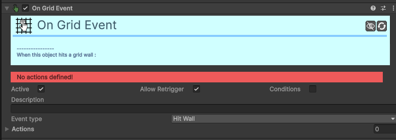

# Trigger-On-Grid-Event

[:material-code-tags: Ver Código Fonte C#](https://github.com/VideojogosLusofona/OkapiKit/blob/main/Assets/OkapiKit/Scripts/Triggers/TriggerOnGridEvent.cs){ .md-button }

Deteta interações específicas do sistema de grelha (Grid).

## Configurações do Inspector

| Campo | Função | Detalhes |
| :--- | :--- | :--- |
| **Active** | Ativação | Define se o componente está ligado e pronto para funcionar. |
| **Tags** | Etiquetas | Etiquetas inteligentes (Hypertags) usadas para identificação e filtros. |
| **Conditions** | Condições | Lista de requisitos (ex: variáveis ou tokens) que têm de ser verdadeiros para a execução. |
| **Event Type** | Tipo de Evento. | **Hit Wall** (parede), **Push Object** (empurrou), **Step End** (parou numa casa), **Rotate End**. |
| **Tags** | Filtro. | Filtra quais os objetos que ativam eventos de contacto ou empurrão. |

## Como configurar

1. **O**: objeto tem de ter um componente `Grid Object`.

2. **Configure**: o evento que deseja detetar (ex: `Step End` é ótimo para verificar se o jogador caiu numa armadilha após cada movimento).

3. **Adicione**: as etiquetas necessárias se estiver a detetar colisões entre objetos da grelha.

