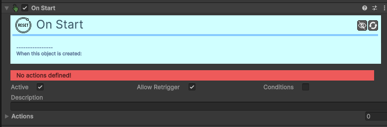

# Trigger-On-Start

[:material-code-tags: Ver Código Fonte C#](https://github.com/VideojogosLusofona/OkapiKit/blob/main/Assets/OkapiKit/Scripts/Triggers/TriggerOnStart.cs){ .md-button }

Dispara ações no momento exato em que o objeto é criado ou a cena começa.

## Configurações do Inspector

*Este trigger não possui configurações específicas, além das Precondições e Ações padrão.*

## Como configurar

1. **Use**: para dar uma velocidade inicial a um projétil assim que ele é criado.

2. **Útil**: para tocar um som de "nascimento" ou criar um efeito de partículas imediato.

3. **Como**: só corre uma vez, é o trigger mais eficiente para preparações iniciais.

