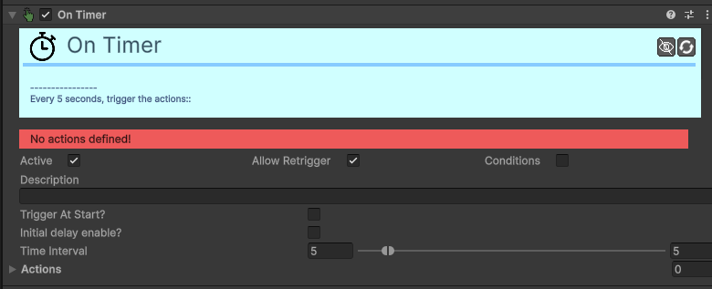

# Trigger-On-Timer

[:material-code-tags: Ver Código Fonte C#](https://github.com/VideojogosLusofona/OkapiKit/blob/main/Assets/OkapiKit/Scripts/Triggers/TriggerOnTimer.cs){ .md-button }

Dispara ações baseando-se em intervalos de tempo ou atrasos.

## Configurações do Inspector

| Campo | Função | Detalhes |
| :--- | :--- | :--- |
| **Active** | Ativação | Define se o componente está ligado e pronto para funcionar. |
| **Tags** | Etiquetas | Etiquetas inteligentes (Hypertags) usadas para identificação e filtros. |
| **Conditions** | Condições | Lista de requisitos (ex: variáveis ou tokens) que têm de ser verdadeiros para a execução. |
| **Active / Retrigger** | Comuns. | Controlo de ativação e repetição do temporizador. |
| **Conditions** | Condições. | O timer só conta se as condições forem verdadeiras. |
| **Trig. At Start?** | No Início. | Se ativo, dispara as ações imediatamente ao começar. |
| **Init. Delay En.** | Atraso. | Ativa um tempo de espera extra antes do primeiro disparo. |
| **Time Interval** | Intervalo. | Tempo entre disparos (suporta intervalo aleatório Min/Max). |
| **Actions** | Ações. | O que disparar quando o tempo termina. |

## Como configurar

1. **Para**: um inimigo que dispara a cada 2 segundos: defina o intervalo como (2, 2) e ligue o **Retrigger**.

2. **Para**: uma bomba que explode passados 3 segundos: defina o intervalo como (3, 3) e desligue o **Retrigger**.

3. **A**: variação aleatória no intervalo é ótima para tornar comportamentos de inimigos menos previsíveis.

