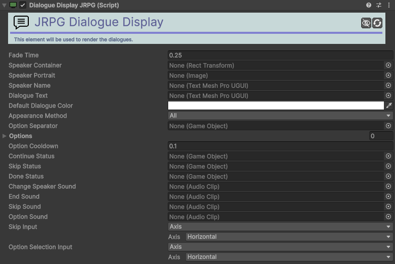

# Dialogue-Display-JRPG

[:material-code-tags: Ver Código Fonte C#](https://github.com/VideojogosLusofona/OkapiKit/blob/main/Assets/OkapiKit/Scripts/Systems/Dialogue/DialogueDisplayJRPG.cs){ .md-button }

Interface visual profissional para diálogos estilo JRPG, com suporte a retratos, nomes de oradores e efeito de escrita.

## Configurações do Inspector

| Campo | Função | Detalhes |
| :--- | :--- | :--- |
| **Active** | Ativação | Define se o componente está ligado e pronto para funcionar. |
| **Tags** | Etiquetas | Etiquetas inteligentes (Hypertags) usadas para identificação e filtros. |
| **Conditions** | Condições | Lista de requisitos (ex: variáveis ou tokens) que têm de ser verdadeiros para a execução. |
| **Fade-Time** | Transição | Tempo de suavização na entrada e saída da janela. |
| **Speaker-Cont.** | Contentor | Transform que agrupa os elementos visuais do orador (nome/retrato). |
| **Speaker-Portrait** | Retrato | Componente `Image` que muda conforme o personagem que fala. |
| **Speaker-Name** | Nome | Componente de texto para o nome do interlocutor. |
| **Dialogue-Text** | Texto | Área principal onde a mensagem é processada e exibida. |
| **Appear-Method** | Exibição | **All** (imediato) ou **Per-Char** (estilo máquina de escrever). |
| **Time-Per-Char** | Velocidade | *(Modo Per-Char)* Tempo em segundos entre cada letra. |
| **Options** | Opções | Lista de botões que servem para as escolhas do diálogo. |
| **Skip-Input** | Comando | Tecla/Botão para avançar a conversa ou acelerar a escrita. |

## Como configurar

1. **Estrutura de UI**: Crie uma Canvas com os elementos básicos (fundo, campo de texto, imagem de retrato).

2. **Atribuição**: Arraste os elementos da sua hierarquia para os campos correspondentes no **Dialogue-Display-JRPG**.

3. **Dialogue Manager**: Garante que este componente está referido no campo **Display** do seu **Dialogue-Manager** global.

4. **Interação**: Configure o **Skip-Input** para permitir que o jogador passe as falas premindo uma tecla (ex: Espaço ou Mouse0).

