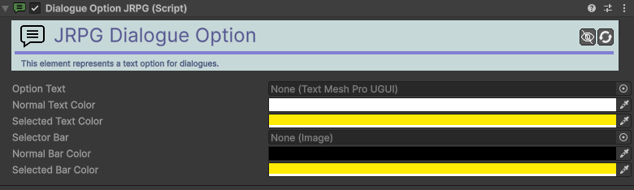

# Dialogue-Option-JRPG

[:material-code-tags: Ver Código Fonte C#](https://github.com/VideojogosLusofona/OkapiKit/blob/main/Assets/OkapiKit/Scripts/Systems/Dialogue/DialogueOptionJRPG.cs){ .md-button }

Representa uma escolha individual dentro de uma conversa JRPG, gerindo o seu estado visual (selecionado/normal).

## Configurações do Inspector

| Campo | Função | Detalhes |
| :--- | :--- | :--- |
| **Active** | Ativação | Define se o componente está ligado e pronto para funcionar. |
| **Tags** | Etiquetas | Etiquetas inteligentes (Hypertags) usadas para identificação e filtros. |
| **Conditions** | Condições | Lista de requisitos (ex: variáveis ou tokens) que têm de ser verdadeiros para a execução. |
| **Option-Text** | Texto | O elemento visual TMP com o texto da opção. |
| **Text-Normal-Color** | Cor Base | Cor do texto quando a opção não está focada. |
| **Text-Sel-Color** | Cor Foco | Cor do texto quando a opção está selecionada. |
| **Selector-Bar** | Indicador | Imagem auxiliar (barra/ícone) que sinaliza a seleção atual. |
| **Bar-Normal-Color** | Cor Barra Base| Cor da barra/indicador em repouso. |
| **Bar-Sel-Color** | Cor Barra Foco| Cor da barra/indicador quando selecionada. |

## Como configurar

1. **Hierarchy**: Coloque este componente num objeto que seja filho da janela de diálogo.

2. **Estilo**: Configure as cores de destaque para que o jogador perceba claramente qual a opção que está a selecionar.

3. **Registro**: No componente **Dialogue-Display-JRPG**, adicione este objeto à lista de **Options**.

4. **Automatização**: O OkapiKit ativará ou ocultará estes botões dinamicamente conforme o conteúdo do diálogo.

