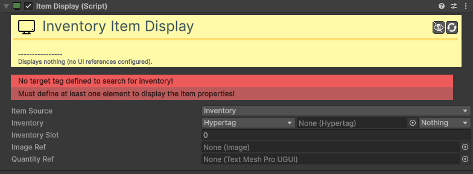

# Item-Display

[:material-code-tags: Ver Código Fonte C#](https://github.com/VideojogosLusofona/OkapiKit/blob/main/Assets/OkapiKit/Scripts/UI/ItemDisplay.cs){ .md-button }

Sincroniza automaticamente a interface de utilizador (UI) com o conteúdo de um slot específico de inventário ou equipamento.

## Configurações do Inspector

| Campo | Função | Detalhes |
| :--- | :--- | :--- |
| **Active** | Ativação | Define se o componente está ligado e pronto para funcionar. |
| **Tags** | Etiquetas | Etiquetas inteligentes (Hypertags) usadas para identificação e filtros. |
| **Conditions** | Condições | Lista de requisitos (ex: variáveis ou tokens) que têm de ser verdadeiros para a execução. |
| **Item-Source** | Origem | Escolha entre monitorizar um **Inventory** ou o sistema de **Equipment**. |
| **Inventory** | Inventário | O alvo a observar (se o modo for Inventory). |
| **Equipment** | Equipamento | O alvo a observar (se o modo for Equipment). |
| **Inventory-Slot** | Índice | Qual o slot do inventário a mostrar (0, 1, 2...). |
| **Equipment-Slot** | Tag Slot | Qual o slot do equipamento a mostrar (via Hyper-Tag). |
| **Image-Ref** | Sprite | O componente `Image` que exibirá o ícone do item. |
| **Quantity-Ref** | Contador | O componente de texto que exibirá o número de itens. |

## Como configurar

1. **Estrutura de UI**: Crie um "slot" visual na sua HUD (ex: um painel com um ícone e um texto).

2. **Atribuição**: Adicione o **Item-Display** a este objeto e ligue-o ao **Inventory** do jogador (usando Hyper-Tag).

3. **Monitorização**: Defina qual o slot exato que este objeto representa. Se o jogador apanhar um item que preencha esse slot, a UI atualizará o ícone e a quantidade instantaneamente.

