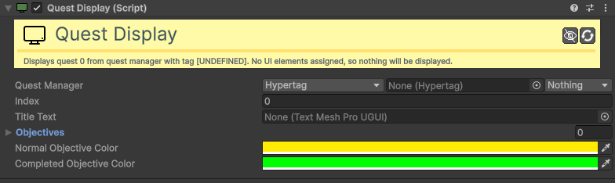

# Quest-Display

[:material-code-tags: Ver Código Fonte C#](https://github.com/VideojogosLusofona/OkapiKit/blob/main/Assets/OkapiKit/Scripts/UI/QuestDisplay.cs){ .md-button }

Interface para exibir no ecrã o estado e os objetivos de uma missão ativa.

## Configurações do Inspector

| Campo | Função | Detalhes |
| :--- | :--- | :--- |
| **Active** | Ativação | Define se o componente está ligado e pronto para funcionar. |
| **Tags** | Etiquetas | Etiquetas inteligentes (Hypertags) usadas para identificação e filtros. |
| **Conditions** | Condições | Lista de requisitos (ex: variáveis ou tokens) que têm de ser verdadeiros para a execução. |
| **Quest-Manager** | Gestor | Referência ao componente central que coordena as missões. |
| **Quest-Index** | Missão | Índice da missão na lista de missões ativas (0 = missão principal). |
| **Title-Text** | Título | Componente de texto onde será escrito o nome da missão. |
| **Objective-Text** | Objetivos | Lista de campos de texto (TMP) para exibir cada etapa da missão. |
| **Normal-Color** | Pendente | Cor do texto para objetivos que o jogador ainda não realizou. |
| **Completed-Color** | Concluído | Cor do texto para os objetivos que já foram finalizados. |

## Como configurar

1. **Objecto HUD**: Adicione este componente a uma caixa de texto na sua interface (ex: painel de missões).

2. **Atribuição**: Ligue-o ao **Quest-Manager** global.

3. **Objetivos**: Se a sua missão tem 3 objetivos, arraste 3 campos de texto para a lista **Objective-Text**.

4. **Visibilidade**: O componente ocultará automaticamente os textos de objetivos que não estiverem a ser usados pela missão atual.

