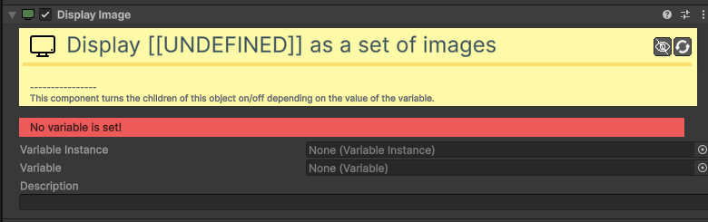

# Value Display Image

[:material-code-tags: Ver Código Fonte C#](https://github.com/VideojogosLusofona/OkapiKit/blob/main/Assets/OkapiKit/Scripts/UI/ValueDisplayImage.cs){ .md-button }

Ideal para indicadores estilo "corações" ou inventários visuais.

## Configurações do Inspector

| Campo | Função | Detalhes |
| :--- | :--- | :--- |
| **Active** | Ativação | Define se o componente está ligado e pronto para funcionar. |
| **Tags** | Etiquetas | Etiquetas inteligentes (Hypertags) usadas para identificação e filtros. |
| **Conditions** | Condições | Lista de requisitos (ex: variáveis ou tokens) que têm de ser verdadeiros para a execução. |
| **Var. Instance / Variable**| Fonte. | Escolha entre uma variável local (no objeto) ou global (asset). |
| **Description** | Descrição. | Campo para notas internas do desenvolvedor. |
| **(Children)** | Imagens. | O componente liga/desliga automaticamente os objetos filhos conforme o valor. |

## Como configurar

1. **Crie**: vários objetos filhos (ex: imagens de corações) dentro do objeto que tem este componente.

2. **Se**: a variável tiver o valor `3`, os primeiros 3 objetos filhos ficarão visíveis e os restantes escondidos.

3. **Atenção**: Esta componente só funciona com variáveis do tipo **Integer** (números inteiros).

