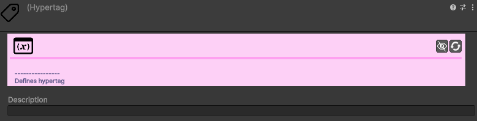

# Hypertag

A **Hypertag** é possivelmente o conceito mais poderoso do OkapiKit. É um sistema que substitui e expande as "Tags" nativas do Unity, permitindo criar lógica complexa de forma muito simples.

---

## O que é uma Hypertag?

Pense numa Hypertag como um **post-it** que pode colar em qualquer objeto do seu jogo. 
Ao contrário das tags normais do Unity:
- Um objeto pode ter **múltiplas** Hypertags ao mesmo tempo (ex: o Jogador pode ser `Player`, `Aliado` e `Heroi`).
- As Hypertags são ficheiros (**Assets**) no seu projeto, o que as torna fáceis de organizar e arrastar.
- Permitem que os componentes se encontrem uns aos outros automaticamente (ex: um inimigo procura qualquer objeto com a tag `Player`).

---

## Passo 1: Criar a Etiqueta (Asset)

Antes de etiquetar os seus objetos, precisa de criar a etiqueta na sua pasta de projeto:

1. Clique com o botão direito na pasta do seu projeto.
2. Selecione **Create > Okapi Kit > Hypertag**.
3. Dê-lhe um nome (ex: `Inimigo`, `Moeda`, `Porta`).

---

## Passo 2: Etiquetar um Objeto (Componente)

Para dar uma etiqueta a um objeto na cena:

1. Selecione o objeto (ex: o seu herói).
2. No Inspector, clique em **Add Component**.
3. Procure por **Hypertagged Object** (ou apenas escreva "Hypertag").
4. Na lista do componente, clique no `+` e arraste o ficheiro de Hypertag que criou no Passo 1.

---

## Exemplos Práticos: "Para que serve isto?"

### 1. Perseguição (Following)
No componente **Movement Follow**, em vez de arrastar o jogador manualmente, escolha o **Target Type: Tag** e selecione a Hypertag `Player`. O inimigo passará a perseguir qualquer objeto que tenha essa etiqueta!

### 2. Triggers de Colisão
No **Trigger On Collision**, pode configurar para o trigger disparar apenas se o objeto que nos tocou tiver a tag `Chave`. Se for uma pedra a tocar, nada acontece.

### 3. Ações em Grupo (Broadcasting)
A **Action Run Tagged Action** permite enviar uma ordem para todos os objetos com uma certa tag. 
Exemplo: "Quando o Boss morre, envia a ordem 'Explodir' para todos os objetos com a tag `barril`".

---

## Resumo das Vantagens
- **Flexibilidade**: Mude o comportamento de vários objetos alterando apenas as suas etiquetas.
- **Desbloqueio**: Crie mecânicas como "Só abro se tiveres a tag `Membro_da_Guilda`".
- **Organização**: Saiba sempre o que é o quê no seu jogo apenas olhando para os componentes de Hypertag.

---

> **Dica**: No componente **Okapi Config**, pode ativar a opção **Display Hypertags** para ver as etiquetas de todos os objetos escritas diretamente na janela do jogo (Scene View)!
