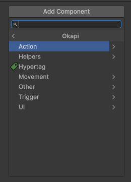

# Bem-vindo ao Manual do OkapiKit versão 1.20.4

O **OkapiKit** é focado em componentes para o **Unity 6**, desenhado para permitir que qualquer pessoa crie experiências interativas e jogos 2D sem a necessidade imediata de escrever código complexo.

Este manual foi criado especialmente para quem está a começar e nunca teve contacto com o Unity ou o OkapiKit.

---

## Índice Completo

Procura um componente específico? Consulte a nossa lista exaustiva:

[**Índice de Referência de Componentes**](components.md)

---

Imagine que criar um jogo é como montar um conjunto de peças de construção. Em vez de escrever instruções complicadas para cada peça, o OkapiKit dá-lhe "comportamentos" prontos a usar:

- **Action**: O que o objeto **faz** (pode piscar, saltar, explodir, tocar um som).
- **Trigger**: **Quando** é que o objeto faz algo (ao carregar numa tecla, ao tocar num inimigo, quando um tempo termina).
- **Movement**: Como é que o objeto se **move** (movimento de plataforma, seguir um caminho, movimento em grelha).
- **Helper**: **Apoio** visual e organizacional.
- **UI**: Como a informação é **exibida** (barras de vida, textos de pontuação, menus de missão).
- **Scriptables**: **Dados** persistentes e configurações (as falas dos diálogos, definições de itens, sistema de som).
- **Other**: **Gestores** e sistemas globais (câmera, sistema de grelha, gestor de inventário).

---

## Noções Básicas no Unity

Se é a sua primeira vez no Unity, lembre-se destes 3 conceitos:

1. **GameObject**: O objeto no jogo (ex: o Jogador).
2. **Componentes**: As peças que anexa ao objeto para lhe dar vida.
3. **Inspector**: Onde configura os valores de cada componente.

---

## Como usar este Manual

Este manual está dividido por categorias lógicas:

- **[Action](action.md)**: Explore as ações que permitem aos seus objetos interagir e reagir.
- **[Helper](helper.md)**: Utilitários para efeitos visuais e organização de profundidade.
- **[Hypertag](hypertag.md)**: O sistema inteligente de etiquetas para identificar objetos.
- **[Movement](movement.md)**: Configure a locomoção física, desde plataformas a grelhas.
- **[Other](other.md)**: Gestores globais, câmaras e configurações de sistema.
- **[Trigger](trigger.md)**: Defina a lógica de "quando" as ações devem ser disparadas.
- **[Scriptables](scriptables.md)**: Gestão de ficheiros de dados para missões, itens e diálogos.
- **[UI](ui.md)**: Tudo o que precisa para exibir informações e interfaces ao jogador.
- **[OkapiKit](okapikit.md)**: Explore os componentes avançados e sistemas que requerem pesquisa manual.
- **[Índice Completo](components.md)**: Consulte a lista exaustiva de todos os componentes do kit.

---

## Adicionar Componentes (Add Component)

Para adicionar qualquer comportamento do OkapiKit, use o botão **Add Component** no Inspector e procure a categoria **Okapi**.

Os componentes estão organizados nas seguintes categorias:

- **Action**: Ações disparadas por Triggers.
- **Helpers**: Componentes auxiliares (ex: efeitos visuais, ordenação 2D).
- **Hypertag**: Sistema de etiquetas para identificação de objetos.
- **Movement**: Diferentes tipos de movimento (Plataforma, Grid, Follow, etc.).
- **Other**: Gestores de sistemas, câmeras, spawners e instâncias de variáveis.
- **Trigger**: Triggers que detetam eventos (Colisão, Input, Timer).
- **UI**: Componentes para exibição de dados no ecrã.

---

> **Dica para Principiantes**: Não tente aprender tudo de uma vez! Comece por fazer um objeto mover-se (Forward Movement) e depois tente fazê-lo reagir a um clique (On Input Trigger).
