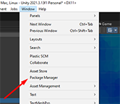
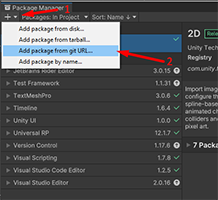

# Como Instalar o OkapiKit

Esta página explica como instalar o OkapiKit no seu projeto **Unity 6** utilizando o **Unity Package Manager (UPM)**. Este é o método recomendado para manter o kit organizado e fácil de atualizar.

---

## Passo 1: Abrir o Package Manager

No Unity, aceda ao menu superior e selecione:
**Window > Package Manager**



---

## Passo 2: Instalar o NaughtyAttributes

O OkapiKit depende de um pacote chamado **NaughtyAttributes** para que o Inspector funcione corretamente.

1.  No Package Manager, clique no botão **+** (canto superior esquerdo).
2.  Selecione **Add package from git URL...**.
3.  Cole o seguinte URL e clique em **Add**:
    ```bash
    https://github.com/dbrizov/NaughtyAttributes.git#upm
    ```



---

## Passo 3: Instalar o OkapiKit

Agora que a dependência está instalada, repita o processo para o OkapiKit:

1.  Clique novamente no botão **+** e selecione **Add package from git URL...**.
2.  Cole o seguinte URL e clique em **Add**:
    ```bash
    https://github.com/VideojogosLusofona/OkapiKit.git#upm
    ```

---

## Passo 4: Instalar os Exemplos (Opcional)

Se desejar explorar os jogos de exemplo (Samples), repita o processo com este URL:
```bash
https://github.com/VideojogosLusofona/OkapiKit.git#samples
```

---

## Como usar os Samples (Instalação via UPM)

Devido à forma como os pacotes funcionam no Unity, não pode abrir as cenas de exemplo diretamente a partir do pacote. Siga estes passos:

1.  Na janela **Project**, vá à pasta `Packages/OkapiKitSamples`.
2.  **Copie** as cenas que deseja explorar para a sua pasta `Assets` pessoal.
3.  Adicione essas cenas ao menu **Build Settings** para que os links entre elas funcionem.

---

## Passo 5: Começar a Criar

Com o OkapiKit instalado, já pode adicionar componentes okapi a qualquer objeto clicando em **Add Component** e procurando a categoria **Okapi**.
