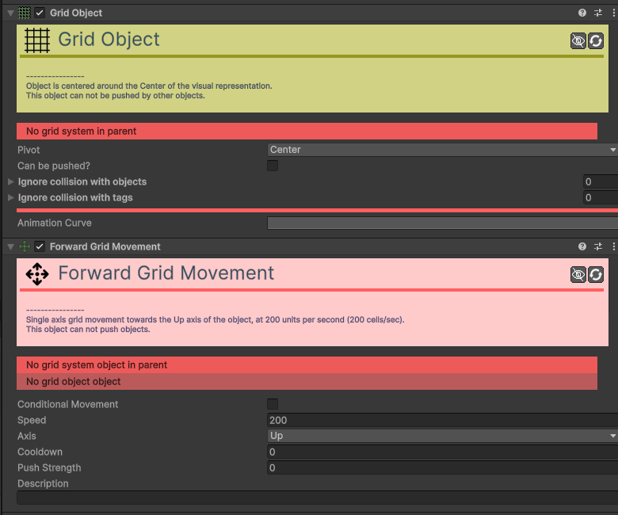
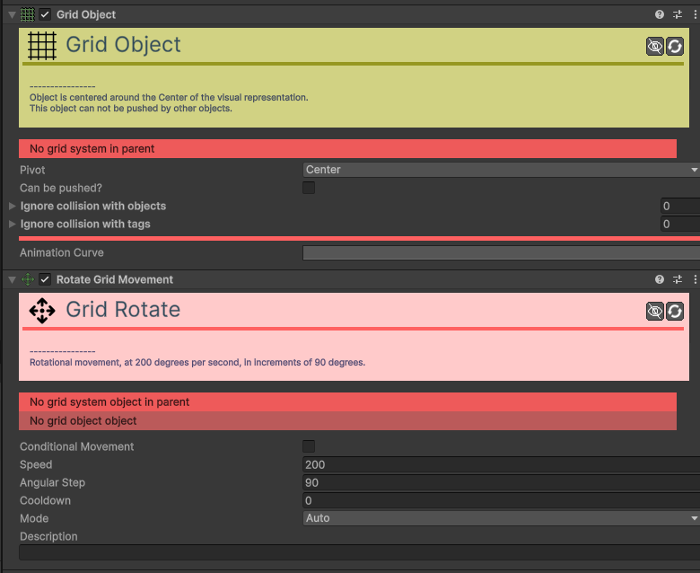
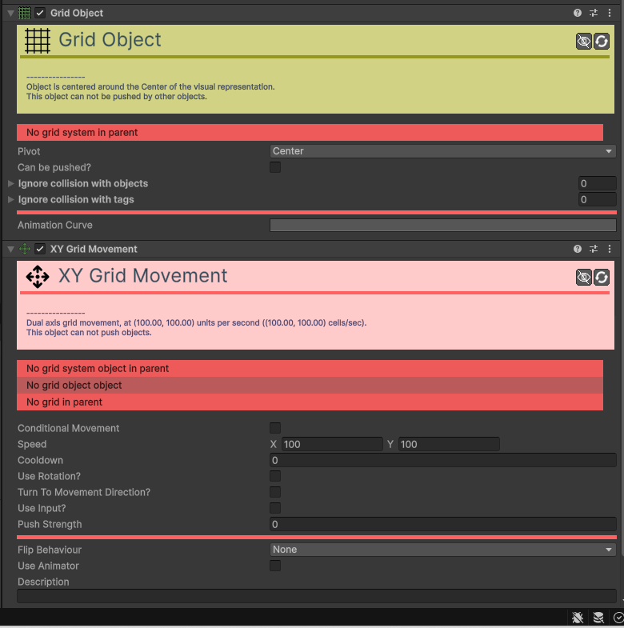

# Movement

Os componentes de **Movement** definem como os seus objetos se deslocam e interagem fisicamente com o mundo do jogo.

---

### [Follow Movement](component/movement/Movement-Follow.md)
Faz com que o objeto persiga continuamente um alvo (objeto, tag ou rato).

| Campo | Descrição | Detalhes |
| :--- | :--- | :--- |
| **Conditional Movement** | Ativa o movimento condicional. | Se ativado, este movimento só afetará o objeto se as condições definidas forem cumpridas. |
| **Conditions** | Condições de ativação. | Visível apenas se `Conditional Movement` estiver ativo. |
| **Speed** | Velocidade máxima. | Rapidez de deslocação em pixéis por segundo. |
| **Target Type** | Tipo de Alvo. | **Tag**: Segue o objeto mais próximo com a etiqueta definida. **Object**: Segue um objeto ligado diretamente. **Mouse**: Segue o cursor do rato. |
| **Target Tag** | Etiqueta do Alvo. | Visível se o tipo for **Tag**. Define qual a Hypertag a perseguir. |
| **Target Object** | Objeto Alvo. | Visível se o tipo for **Object**. Arraste o objeto para aqui. |
| **Camera Tag / Object**| Câmara. | Visível se o tipo for **Mouse**. Necessário para converter a posição do rato no ecrã para o mundo do jogo. |
| **Relative Movement** | Movimento Relativo. | Se ativo, o objeto preservará a distância e ângulo iniciais em relação ao alvo. |
| **Stopping Distance** | Distância de Paragem. | Distância mínima ao alvo para o objeto parar de se mover. |
| **Align With Direction** | Alinhar com a Direção. | Se ativo, o objeto rodará automaticamente para apontar na direção do movimento. |
| **Alignment Axis** | Eixo de Alinhamento. | Define se a "frente" do objeto é o seu eixo **Right** ou **Up**. |
| **Max Rotation Speed** | Vel. Rotação Máxima. | Rapidez máxima de rotação suave em graus por segundo. |
| **Description** | Notas do utilizador. | Campo para anotações internas. |

### [Forward Movement](component/movement/Movement-Forward.md)
Faz com que o objeto se mova continuamente na sua direção "frente" (Right ou Up). Ideal para projéteis.

| Campo | Descrição | Detalhes |
| :--- | :--- | :--- |
| **Conditional Movement** | Ativa o movimento condicional. | Se ativado, este movimento só afetará o objeto se as condições definidas forem cumpridas. |
| **Conditions** | Condições de ativação. | Visível apenas se `Conditional Movement` estiver ativo. |
| **Speed** | Velocidade de movimento. | Define a rapidez com que o objeto se desloca, em pixéis por segundo. |
| **Axis** | Eixo frontal. | Define qual o eixo do objeto que deve ser considerado a "frente": **Right** (Eixo X) ou **Up** (Eixo Y). |
| **Description** | Notas do utilizador. | Um campo de texto para adicionar notas ou descrições internas sobre a função deste componente no jogo. |

### [Grid Follow Movement](component/movement/Movement-Grid-Follow.md)
Faz com que o objeto persiga um alvo movendo-se casa a casa numa grelha.

| Campo | Função | Detalhes |
| :--- | :--- | :--- |
| **Speed** | Velocidade. | Rapidez de movimento entre células. |
| **Target Type**| Tipo de Alvo. | **Tag**, **Object** ou **Mouse**. |
| **Cooldown** | Cooldown. | Tempo de espera entre cada movimento de casa. |
| **Rotate Towards**| Orientação. | Roda para a direção do movimento na grelha. |

### [Grid Forward Movement](component/movement/Movement-Grid-Forward.md)
Move o objeto continuamente na sua direção "frente" através da grelha.

| Campo | Função | Detalhes |
| :--- | :--- | :--- |
| **Speed** | Velocidade. | Rapidez de deslocação entre células. |
| **Cooldown** | Cooldown. | Tempo de espera entre cada salto de casa. |
| **Align Axis** | Eixo Frontal. | Define qual o eixo é a frente (**Right** ou **Up**). |

### [Grid Path Movement](component/movement/Movement-Grid-Path.md)
Faz com que o objeto siga um caminho pré-definido (Path) movendo-se casa a casa.

| Campo | Função | Detalhes |
| :--- | :--- | :--- |
| **Speed** | Velocidade. | Rapidez de movimento entre células. |
| **Path** | Caminho. | O objeto `Path` que define a trajetória. |
| **Loop** | Repetir. | Se deve voltar ao início ao terminar o caminho. |
| **Cooldown** | Cooldown. | Tempo de espera entre cada movimento. |

### [Grid Rotate Movement](component/movement/Movement-Grid-Rotate.md)
Controla a rotação de um objeto em incrementos fixos (ex: 90º), mantendo o alinhamento com a grelha.

| Campo | Função | Detalhes |
| :--- | :--- | :--- |
| **Speed** | Velocidade. | Rapidez da animação de rotação. |
| **Step Size** | Passo Angular. | O ângulo de cada "salto" (ex: 90 para as 4 direções cardinais). |
| **Mode** | Modo. | **Auto**, **Input**, **Target**, **Movement**. |
| **Cooldown** | Cooldown. | Tempo mínimo entre rotações. |

### [Grid XY Movement](component/movement/Movement-Grid-XY.md)
Permite controlar um objeto na grelha nos eixos X e Y.

| Campo | Função | Detalhes |
| :--- | :--- | :--- |
| **Speed** | Velocidade. | Rapidez de movimento entre células. |
| **Cooldown** | Cooldown. | Intervalo mínimo entre movimentos. |
| **Input Type** | Controle. | Como o jogador controla o objeto (Axis, Button, Key). |
| **Push Strength** | Empurrão. | Permite empurrar outros `Grid Objects`. |

### [Path Movement](component/movement/Movement-Path.md)
Faz com que o objeto siga uma trajetória pré-definida.

| Campo | Função | Detalhes |
| :--- | :--- | :--- |
| **Path** | Caminho. | Referência ao objeto `Path` a seguir. |
| **Speed / Duration**| Velocidade. | Define se o objeto segue a uma velocidade fixa ou se demora um tempo fixo a percorrer o caminho. |
| **Loop** | Repetir. | Se ativo, o objeto volta ao início quando chegar ao fim do caminho. |
| **Rel. / Abs.** | Relativo. | **Relative**: O caminho começa na posição atual. **Absolute**: Teletransporta para o início do caminho. |
| **Rot. Behaviour** | Orientação. | Define se o objeto roda para alinhar com o caminho (**Align X** ou **Align Y**). |

### [Platformer Movement](component/movement/Movement-Platformer.md)
Cria mecânicas de plataformas 2D com saltos, gravidade e colisão com o chão.

| Campo | Descrição | Detalhes |
| :--- | :--- | :--- |
| **Conditional Movement** | Ativa o movimento condicional. | Se ativado, este movimento só afetará o objeto se as condições definidas forem cumpridas. |
| **Conditions** | Condições de ativação. | Visível apenas se `Conditional Movement` estiver ativo. |
| **Speed** | Velocidade e Salto. | **X**: Velocidade horizontal máxima. **Y**: Força inicial do salto. |
| **Horizontal Input Type**| Controlo Horizontal. | Método de input: **Axis**, **Button** ou **Key**. |
| **Ground Check Collider**| Detetor de Chão. | Colisor no fundo do personagem que deteta se ele está no chão. |
| **Ground Layer Mask** | Camada do Chão. | Define quais as camadas que são consideradas superfícies sólidas. |
| **Gravity Scale** | Escala de Gravidade. | Define o peso do personagem (multiplica a gravidade global). |
| **Use Terminal Velocity**| Velocidade Máxima. | Se ativo, limita a velocidade máxima de queda. |
| **Terminal Velocity** | Vel. Máx. Queda. | O valor máximo da velocidade de queda. |
| **Coyote Time** | Tolerância de Queda. | Tempo durante o qual ainda se pode saltar após sair de uma plataforma. |
| **Air Control** | Controlo no Ar. | Se ativo, o jogador pode mudar de direção enquanto salta ou cai. |
| **Air Collider** | Colisor de Ar. | Colisor usado quando o personagem não está no chão. |
| **Ground Collider** | Colisor de Chão. | Colisor usado quando o personagem está no chão. |
| **Jump Type** | Tipo de Salto. | **None**, **Fixed** ou **Variable** (depende de quanto tempo a tecla é premida). |
| **Jump Input Type** | Controlo de Salto. | Método de input para o salto. |
| **Max Jump Count** | Número de Saltos. | Define se o jogador pode fazer saltos duplos, triplos, etc. |
| **Jump Buffering Time**| Janela de Salto. | Executa o salto automaticamente se premido pouco antes de aterrar. |
| **Jump Max. Hold Time**| Tempo de Salto Variável.| Tempo máximo que se pode segurar a tecla para saltar mais alto. |
| **Glide Behaviour** | Comportamento Planar. | **None**, **Enabled** ou **Timer**. |
| **Glide Input Type** | Controlo Planar. | Método de input para planar. |
| **Glide Max. Time** | Tempo Máx. Planar. | Visível no modo **Timer**. |
| **Max Glide Speed** | Velocidade ao Planar. | Velocidade máxima de descida enquanto plana. |
| **Flip Behaviour** | Inversão de Sprite. | Reação visual do sprite ao mudar de direção. |
| **Use Animator** | Usar Animador. | Se ativo, envia dados para um Animador. |
| **Animator** | Animador. | Referência ao componente `Animator`. |
| **Description** | Notas do utilizador. | Campo para anotações internas. |

### [Rotate Movement](component/movement/Movement-Rotate.md)
Controla a rotação de um objeto, seja de forma automática, por input ou mirando um alvo.

| Campo | Função | Detalhes |
| :--- | :--- | :--- |
| **Speed** | Velocidade. | Rapidez de rotação em graus por segundo. |
| **Mode** | Modo. | **Auto**, **Input Set**, **Input Delta**, **Target**, **Movement**. |
| **Axis to Align** | Eixo. | Qual o eixo do objeto aponta para o destino (**Up** ou **Right**). |
| **Input Type** | Controle. | Como o jogador controla a rotação. |

### [XY Movement](component/movement/Movement-XY.md)
Permite controlar o movimento de um objeto nos eixos X (horizontal) e Y (vertical).

| Campo | Descrição | Detalhes |
| :--- | :--- | :--- |
| **Conditional Movement** | Ativa o movimento condicional. | Se ativado, este movimento só afetará o objeto se as condições definidas forem cumpridas. |
| **Conditions** | Condições de ativação. | Visível apenas se `Conditional Movement` estiver ativo. |
| **Speed** | Velocidade máxima. | Rapidez máxima de deslocação em unidades do mundo (pixéis) por segundo. |
| **Limit Speed?** | Limitar velocidade? | Se ativo, limita a velocidade total em movimentos diagonais. |
| **Maximum Speed** | Velocidade Máxima Absoluta. | Visível apenas se `Limit Speed?` estiver ativo. |
| **Use Rotation?** | Usar Rotação? | Se ativo, as velocidades X e Y são relativas à rotação do objeto. |
| **Turn To Movement Direction?** | Virar para a Direção? | Se ativo, o objeto rodará automaticamente para a direção do movimento. |
| **Axis to align** | Eixo a alinhar. | Define se o objeto aponta para a "frente" com o seu eixo **Right** ou **Up**. |
| **Max turn speed** | Vel. rotação máx. | Velocidade máxima de rotação suave em graus por segundo. |
| **Use Input?** | Usar Input? | Define se o movimento é controlado pelo jogador. |
| **Use Inertia?** | Usar Inércia? | Se ativo, o objeto ganha e perde velocidade gradualmente. |
| **Stop Time** | Tempo de paragem. | Tempo que o objeto demora a parar completamente. |
| **Input Type** | Tipo de Input. | Método de controlo: **Axis**, **Button** ou **Key**. |
| **Flip Behaviour** | Comportamento de Inversão. | Reação visual do sprite ao mudar de direção. |
| **Use Animator** | Usar Animador. | Se ativo, controla parâmetros num `Animator`. |
| **Animator** | Animador. | Referência ao componente `Animator`. |
| **Description** | Notas do utilizador. | Campo para anotações internas. |
