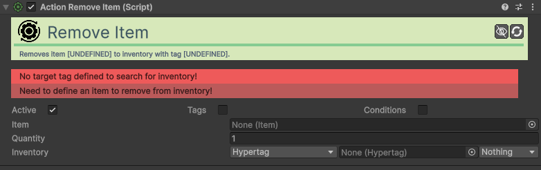
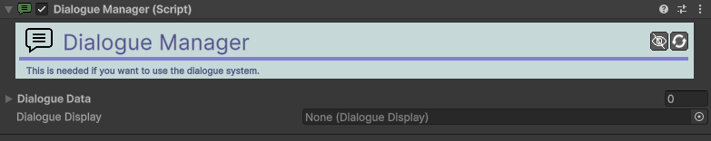

> !!!WARNING
> Os componentes listados abaixo não aparecem diretamente nas subcategorias do menu **Okapi** (Action, Movement, etc.). Para os encontrar no Unity, deve escrever o seu nome no campo de pesquisa do **Add Component** ou escrever **OkapiKit**.

### [Action Add Item](component/okapikit/Action-Add-Item.md)
Adiciona um item específico ao inventário.

| Campo | Função | Detalhes |
| :--- | :--- | :--- |
| **Item** | Item | O asset de item (Scriptable-Object) a adicionar. |
| **Quantity** | Quantidade | Número de unidades a adicionar. |
| **Inventory** | Inventário | O alvo onde o item será colocado. |

### [Action Equip Item](component/okapikit/Action-Equip-Item.md)
Equipa um item num personagem através do sistema de equipamento.

| Campo | Função | Detalhes |
| :--- | :--- | :--- |
| **Equipment** | Sistema | O componente de equipamento alvo. |
| **Item-Source** | Origem | Escolha entre **Explicit** (definido na ação), **Inventory-Item** (procura no inventário) ou **Inventory-Slot**. |
| **Item** | Item | O item a equipar (usado em modo Explicit ou Inventory-Item). |
| **Inventory** | Inventário | Inventário a consultar (se aplicável). |
| **Inventory-Slot** | Slot | Índice do slot a equipar (em modo Inventory-Slot). |
| **Unequip-If-Equipped**| Alternar | Se o item já estiver equipado, será desequipado. |

### [Action Remove Item](component/okapikit/Action-Remove-Item.md)
Remove um item específico do inventário.

| Campo | Função | Detalhes |
| :--- | :--- | :--- |
| **Item** | Item | O asset de item a remover. |
| **Quantity** | Quantidade | Número de unidades a remover. |
| **Inventory** | Inventário | Inventário onde o item será procurado. |

### [Action Talk](component/okapikit/Action-Talk.md)
Inicia uma conversa específica gerida pelo Dialogue-Manager.

| Campo | Função | Detalhes |
| :--- | :--- | :--- |
| **Dialogue-Key** | Identificador | O nome (key) da conversa a iniciar no Dialogue-Manager. |

### [AI](component/okapikit/AI.md)
Sistema de inteligência artificial versátil que gere estados como Patrulha, Perseguição e Fuga.

| Campo | Função | Detalhes |
| :--- | :--- | :--- |
| **Agent-Radius** | Raio | Define o tamanho do agente para colisões com obstáculos. |
| **Agent-Offset** | Desvio | Ajuste posicional do centro do agente. |
| **Flags** | Capacidades | Ativa/Desativa comportamentos: **Wander**, **Flee**, **Chase**, **Search**, **Patrol**. |
| **Obstacle-Mask** | Paredes | Layers de colisão que a IA deve evitar. |
| **Wander-Radius** | Deambular | Distância máxima do ponto inicial ao deambular. |
| **Chase-View-Dist** | Visão | Distância máxima de deteção de alvos para perseguição. |
| **Flee-Radius** | Fuga | Distância à qual o agente começa a fugir de ameaças. |

### [Bounce Walk](component/okapikit/Bounce-Walk.md)
Adiciona um efeito visual de caminhar aos saltos a um objeto enquanto este se move.

| Campo | Função | Detalhes |
| :--- | :--- | :--- |
| **Target** | Alvo | O Transform que será animado (geralmente o visual do objeto). |
| **Step-Time** | Ritmo | Tempo de duração de cada "passo" do salto. |
| **Step-Height** | Altura | Quão alto o objeto salta em cada passo. |
| **Teleport-Dist** | Limite | Se o objeto se mover mais que isto instantaneamente, o efeito reinicia. |

### [Combat Text](component/okapikit/Action-Combat-Text.md)
Ação para disparar textos flutuantes (ex: textos de dano).

| Campo | Função | Detalhes |
| :--- | :--- | :--- |
| **Target-Transform** | Origem | Localização onde o texto irá aparecer. |
| **Text** | Mensagem | O texto que será exibido (ex: "CRITICAL!"). |
| **Color** | Cor | A cor do texto flutuante. |
| **Duration** | Duração | Tempo que o texto permanece visível no ecrã. |

### [Combat Text Manager](component/okapikit/Combat-Text-Manager.md)
Gestor global que controla a criação e animação de todos os textos de combate.

| Campo | Função | Detalhes |
| :--- | :--- | :--- |
| **Text-Prefab** | Prefab | O objeto de UI (TMP-Text) que será usado como base. |
| **Default-Time** | Tempo Padrão | Duração padrão se não for especificada na ação. |
| **Movement-Vector** | Direção | Para onde o texto flutua (ex: para cima). |
| **Fade-Rate** | Desvanecer | Velocidade com que o texto desaparece. |

### [Combat Text Pivot](component/okapikit/Combat-Text-Pivot.md)
Componente auxiliar para definir pontos de spawn personalizados de texto de combate.

> [!NOTE]
> Este componente não tem propriedades configuráveis; serve apenas como marcador de posição.

### [Dialogue Display JRPG](component/ui/Dialogue-Display-JRPG.md)
Interface visual profissional para diálogos estilo JRPG.

| Campo | Função | Detalhes |
| :--- | :--- | :--- |
| **Fade-Time** | Transição | Tempo de entrada e saída da janela de diálogo. |
| **Speaker-Cont.** | Contentor | Rect-Transform que contém o retrato e o nome. |
| **Speaker-Portrait** | Retrato | Imagem que exibe o busto do personagem. |
| **Speaker-Name** | Nome | Texto que exibe quem está a falar. |
| **Dialogue-Text** | Texto | Área principal onde as frases aparecem. |
| **Appear-Method** | Exibição | **All** (imediato) ou **Per-Char** (máquina de escrever). |
| **Options** | Opções | Lista de botões de escolha de diálogo. |
| **Skip-Input** | Comando | Tecla para avançar ou acelerar o texto. |

### [Dialogue Manager](component/okapikit/Dialogue-Manager.md)
Controla a base de dados de conversas e liga as ações de fala à interface visual.

| Campo | Função | Detalhes |
| :--- | :--- | :--- |
| **Dialogue-Data** | Dados | Lista de ativos de dados de diálogo (Scriptable-Objects). |
| **Display** | Interface | Referência ao componente **Dialogue-Display** a utilizar. |

### [Dialogue Option JRPG](component/ui/Dialogue-Option-JRPG.md)
Representa uma escolha individual dentro de uma conversa JRPG.

| Campo | Função | Detalhes |
| :--- | :--- | :--- |
| **Option-Text** | Texto | O element visual TMP com o texto da opção. |
| **Text-Normal-Color** | Cor Base | Cor do texto quando não está selecionado. |
| **Text-Sel-Color** | Cor Foco | Cor do texto quando o jogador passa por cima. |
| **Selector-Bar** | Indicador | Imagem que sinaliza visualmente a seleção. |

### [Equipment](component/okapikit/Equipment.md)
Gere os itens equipados num personagem em slots específicos.

| Campo | Função | Detalhes |
| :--- | :--- | :--- |
| **Linked-Inventory** | Inventário | O inventário de onde os itens são puxados. |
| **Available-Slots** | Slots | Lista de Hyper-Tags que definem os espaços (ex: Head, Body). |
| **Combat-Text-En.** | Notificar | Se deve mostrar texto flutuante ao equipar/desequipar. |

### [Inventory](component/okapikit/Inventory.md)
Permite carregar e gerir coleções de itens (ScriptableObjects) com suporte a limites e notificações.

| Campo | Função | Detalhes |
| :--- | :--- | :--- |
| **Limited** | Limitar | Ativa o limite máximo de slots. |
| **Max-Slots** | Capacidade | Número de espaços disponíveis (se limitado). |
| **Combat-Text-En.** | Notificar | Mostra avisos de itens recebidos/perdidos. |

### [Item Display](component/ui/Item-Display.md)
Sincroniza automaticamente a UI com o conteúdo de um slot de inventário ou equipamento.

| Campo | Função | Detalhes |
| :--- | :--- | :--- |
| **Item-Source** | Tipo | Monitorizar **Inventory** ou **Equipment**. |
| **Inventory-Slot** | Slot | Qual o índice do slot a observar (0, 1, 2...). |
| **Equipment-Slot** | Slot Equip. | Qual a Hyper-Tag do slot a observar. |
| **Image-Ref** | Ícone | Imagem que mostrará o desenho do item. |
| **Quantity-Ref** | Contador | Texto que mostrará a quantidade do item. |

### [Quest Display](component/ui/Quest-Display.md)
Interface para mostrar o estado atual de uma missão e os seus objetivos.

| Campo | Função | Detalhes |
| :--- | :--- | :--- |
| **Quest-Manager** | Gestor | Referência ao gestor de missões. |
| **Quest-Index** | Missão | Índice da missão a exibir na lista ativa. |
| **Title-Text** | Título | Campo TMP para o nome da missão. |
| **Objective-Text** | Objetivos | Lista de campos de texto para cada objetivo. |
| **Normal-Color** | Cor Pendente | Cor para objetivos não concluídos. |
| **Completed-Color** | Cor Concluída | Cor para objetivos finalizados. |

### [Quest Manager](component/okapikit/Quest-Manager.md)
Motor central que gere o progresso de missões, tokens e estados de conclusão.

| Campo | Função | Detalhes |
| :--- | :--- | :--- |
| **Start-Quests** | Iniciais | Missões que começam já ativas. |
| **Target-Inv.** | Inventário | Associar inventário para verificação de itens de missão. |
| **Combat-Text-En.** | Notificar | Mostrar progresso de missões via texto de combate. |

### [Resource](component/okapikit/Resource.md)
Gere valores numéricos dinâmicos com limites (ex: Vida, Mana, Moedas).

| Campo | Função | Detalhes |
| :--- | :--- | :--- |
| **Type** | Tipo | O ativo **Resource-Type** que define os limites. |
| **Flags** | Opções | **Global-Cooldown**, **Cooldown-Per-Source**, **Enable-Combat-Text**. |
| **Start-Value** | Inicial | Valor com que o recurso começa na cena. |

### [Sprite Effect](component/okapikit/Sprite-Effect.md)
Controla efeitos visuais de shaders no Sprite-Renderer, como contornos e flashes.

| Campo | Função | Detalhes |
| :--- | :--- | :--- |
| **Effects** | Efeitos | Escolha ativável: **Color-Remap**, **Inverse**, **Color-Flash**, **Outline**. |
| **Palette** | Paleta | Troca de cores (usado em Color-Remap). |
| **Outline-Width** | Espessura | Tamanho da linha de contorno. |
| **Flash-Color** | Cor Flash | Cor aplicada no efeito de flash. |
| **Create-Mat-Copy** | Isolar | Se deve criar uma cópia do material (evita afetar outros sprites). |