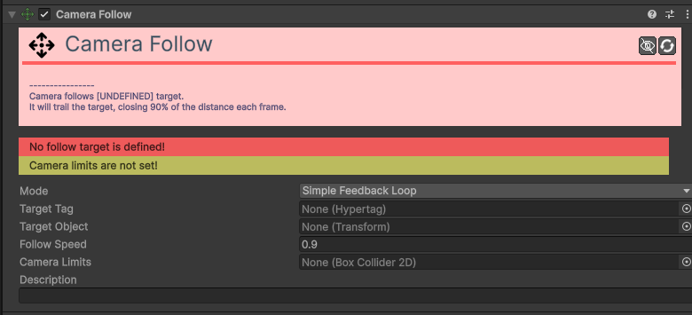
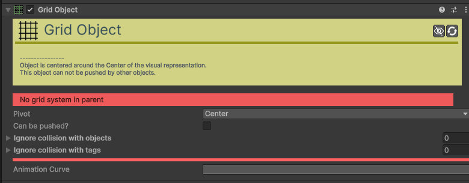
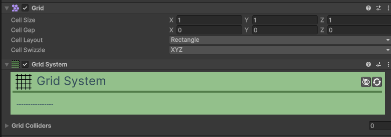
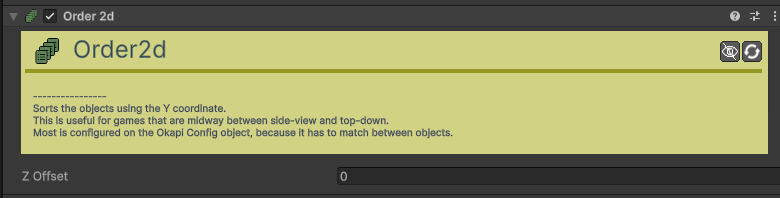
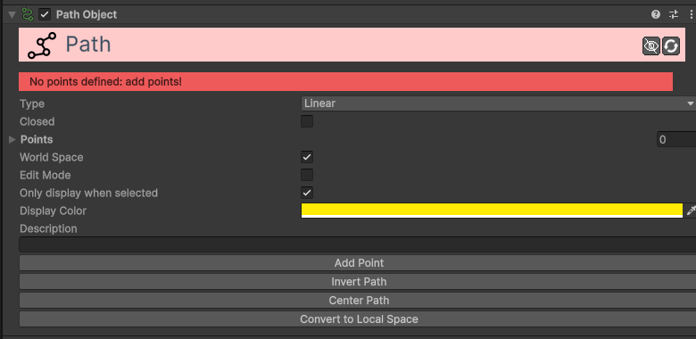
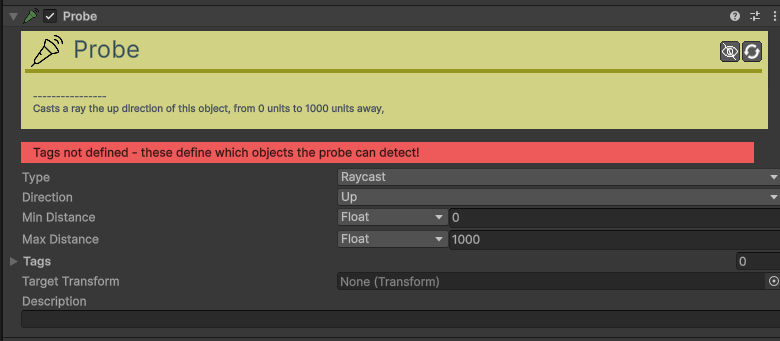
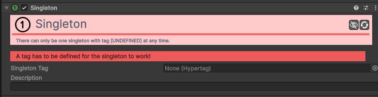
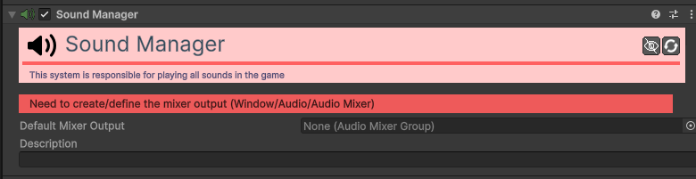
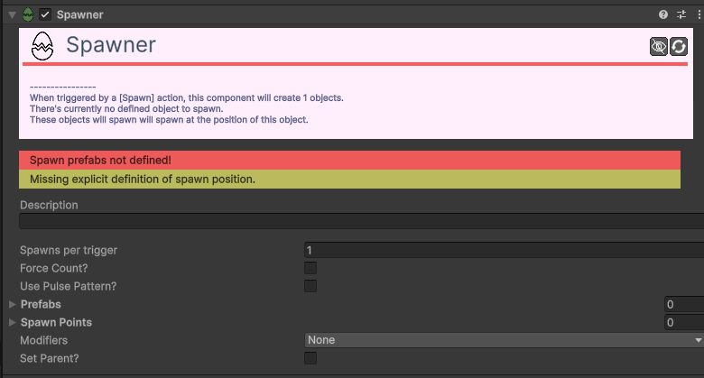
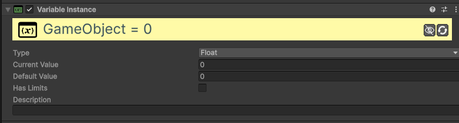

# Other

Componentes de sistema que gerem inteligência artificial, câmaras, dados e lógica global.

---

### [Camera Follow 2D](component/other/CameraFollow2d.md)
Faz com que a câmara siga um alvo (geralmente o jogador) com suavidade e limites.

| Campo | Função | Detalhes |
| :--- | :--- | :--- |
| **Mode** | Tipo de Mov. | **Simple Feedback Loop** (suave), **Camera Trap**, **Exponential Decay**. |
| **Target Tag** | Alvo. | A câmara foca nos objetos com esta tag. |
| **Follow Speed** | Velocidade. | Quão rápido a câmara alcança o alvo. |
| **Camera Limits** | Limites. | Arraste um `Box Collider 2D` para prender a câmara ao mapa. |

### [Grid Object](component/other/GridObject.md)
Define um objeto como participante no sistema de grelha.

| Campo | Função | Detalhes |
| :--- | :--- | :--- |
| **Pivot** | Pivot. | Ponto de alinhamento com a célula da grelha (Center, TopLeft, etc). |
| **Can Push** | Empurrável. | Se o objeto pode ser movido por outros. |
| **Mass** | Massa. | Define a força necessária para empurrar este objeto. |

### [Grid System](component/other/GridSystem.md)
Gestor central de movimentos e colisões em grelha.

| Campo | Função | Detalhes |
| :--- | :--- | :--- |
| **Grid Colliders** | Paredes. | Lista de colisores que o sistema lê como "obstáculos" na grelha. |

### [Order 2D](component/helpers/Order2d.md)
Gere o Sorting Order de sprites dinamicamente (também disponível em Helper).

### [Path](component/other/Path.md)
Define uma trajetória (linha ou curva) para ser seguida por movimentos.

| Campo | Função | Detalhes |
| :--- | :--- | :--- |
| **Type** | Formato. | **Linear**, **Smooth** (curvas), **Circle**, **Arc**, **Polygon**. |
| **Closed** | Ciclo. | Se o último ponto se liga ao primeiro. |
| **Edit Mode** | Editar. | Ative para arrastar os pontos diretamente na janela **Scene**. |

### [Probe](component/other/Probe.md)
Deteta objetos numa direção específica sem usar o sistema de colisão física.

| Campo | Função | Detalhes |
| :--- | :--- | :--- |
| **Type** | Tipo. | **Raycast** (linha), **Circlecast** (círculo), **Colliders**. |
| **Direction** | Direção. | Para onde a sonda "aponta" (Relative, Absolute, Target). |
| **Distance** | Alcance. | Quão longe a sonda deteta objetos. |
| **Tags** | Filtro. | Quais Hypertags a sonda deve detetar. |

### [Singleton](component/other/Singleton.md)
Garante que apenas existe uma instância de um objeto no jogo, mantendo-o entre cenas.

| Campo | Função | Detalhes |
| :--- | :--- | :--- |
| **Singleton Tag** | Identificador. | A tag que identifica este Singleton (ex: "GameManager", "SoundManager"). |

### [Sound Manager](component/other/SoundManager.md)
Gere a reprodução de áudio, múltiplas fontes e volumes globais.

| Campo | Função | Detalhes |
| :--- | :--- | :--- |
| **Mixer Output** | Saída Áudio. | O canal do Unity Audio Mixer (ex: "SFX" ou "Music"). |

### [Spawner](component/other/Spawner.md)
Gere a criação (spawn) de múltiplos objetos com base em padrões ou áreas.

| Campo | Função | Detalhes |
| :--- | :--- | :--- |
| **Prefabs** | Moldes. | Lista de objetos que podem ser criados aleatoriamente. |
| **Spawn Points** | Locais. | Lista de pontos (objeto ou tag) onde os objetos aparecem. |
| **Point Type** | Direção. | **Random**, **Sequence**, **All**. |
| **Pulse Pattern** | Ritmo. | Padrão de texto para vagas (ex: "xoxo"). |
| **Force Count** | Quantidade. | Mantém sempre X objetos ativos na cena. |

### [Variable Instance](component/other/VariableInstance.md)
Armazena dados locais num objeto (ex: força, velocidade, estado).

| Campo | Função | Detalhes |
| :--- | :--- | :--- |
| **Type** | Tipo dado. | **Integer** (inteiros) ou **Float** (decimais). |
| **Default Value** | Inicial. | Valor quando o objeto entra na cena. |
| **Has Limits** | Limites. | Define valores mínimos e máximos. |
