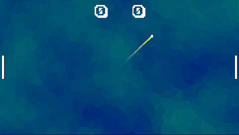
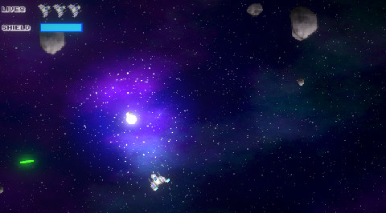
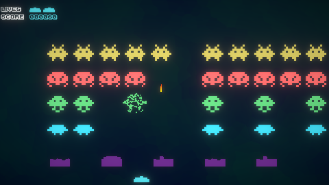
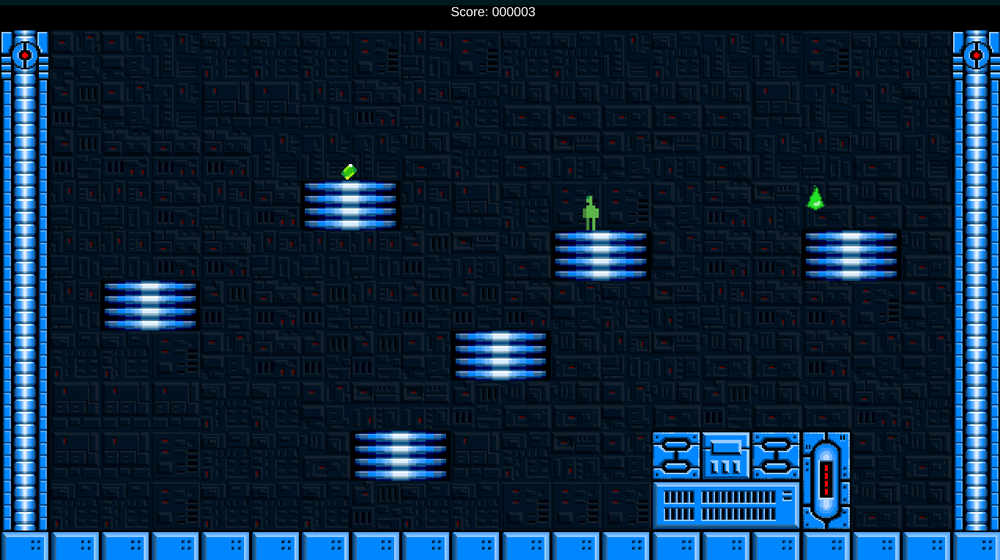
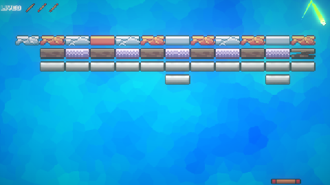
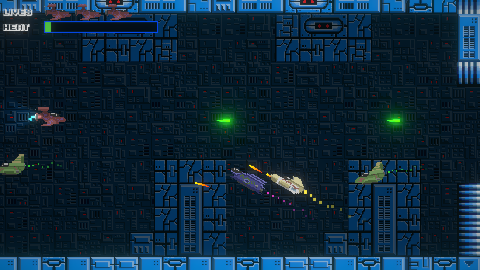
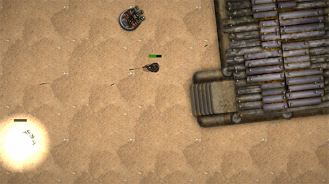
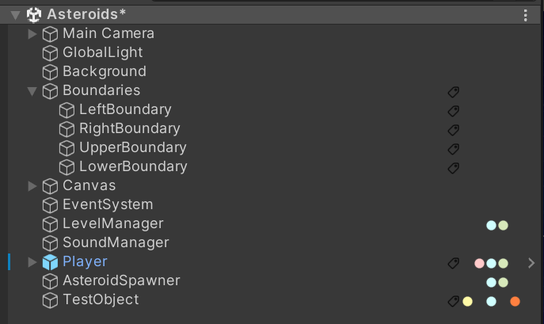
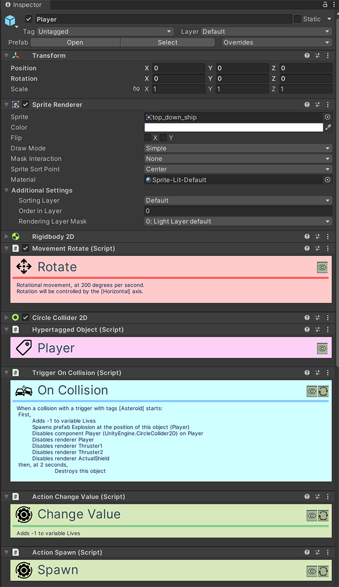

# Jogos de Exemplo (Samples)

O OkapiKit inclui uma pasta chamada **OkapiKitSamples** com vários jogos de exemplo completos. Estes exemplos são a melhor maneira de aprender como combinar diferentes componentes para criar mecânicas de jogo reais.

Pode encontrar estes exemplos em: `Assets/OkapiKitSamples/`

---

## Lista de Jogos e Componentes Usados

Aqui estão os principais exemplos incluídos e uma breve descrição do que poderá aprender com eles:

### 1. Pong

O clássico jogo de ténis para dois jogadores.

*   **Componentes Chave**:
    *   **Movement-XY**: Usado nas raquetes para subir e descer.
    *   **Movement-Forward**: Usado na bola para manter uma velocidade constante.
    *   **Trigger-On-Collision**: Para detetar o toque na raquete e fazer a bola ressaltar.
    *   **Action-Change-Value**: Para atualizar a pontuação dos jogadores.

### 2. Asteroids

Jogo de naves onde tem de destruir asteroides e evitar colisões.

*   **Componentes Chave**:
    *   **Movement-Forward & Movement-Rotate**: Para controlar a inércia e rotação da nave.
    *   **Trigger-On-Input**: Para disparar lasers (tecla Espaço).
    *   **Action-Spawn**: Para criar os projéteis no bico da nave.
    *   **Action-Destroy-Object**: Usado quando um asteroide é atingido.

### 3. Space Invaders

Defenda a terra de hordas de alienígenas que descem no ecrã.

*   **Componentes Chave**:
    *   **Trigger-On-Timer**: Para controlar a cadência de tiro dos inimigos.
    *   **Movement-XY**: Para o movimento lateral do jogador e dos aliens.
    *   **Action-Change-Scene**: Para mudar de nível ou mostrar o ecrã de "Game Over".

### 4. Platformer

Um exemplo de jogo de plataformas estilo Mario.

*   **Componentes Chave**:
    *   **Movement-Platformer**: O componente principal para saltos, gravidade e corrida.
    *   **Trigger-On-Collision**: Para detetar se o jogador caiu em espinhos ou tocou num inimigo.
    *   **Action-Animation**: Para gerir as animações de andar, saltar e estar parado.

### 5. Breakout

Destrua blocos com uma bola e uma raquete.

*   **Componentes Chave**:
    *   **Movement-XY**: Para a raquete do jogador.
    *   **Trigger-On-Collision**: Para detetar o impacto nos blocos.
    *   **Action-Destroy-Object**: Para remover os blocos atingidos.
    *   **Action-Play-Sound**: Efeitos sonoros em cada impacto.

### 6. Side Shooter

Um "Shoot 'em up" horizontal.

*   **Componentes Chave**:
    *   **Action-Spawn**: Para criar inimigos e projéteis.
    *   **Movement-Forward**: Para o movimento automático dos inimigos da direita para a esquerda.
    *   **UI (Value-Display-Text)**: Para mostrar a vida e pontuação no ecrã.

### 7. Commando

Um jogo de ação top-down.

*   **Componentes Chave**:
    *   **Movement-XY**: Para controlo do personagem em todas as direções.
    *   **Trigger-On-Collision**: Para detetar balas inimigas ou itens.
    *   **Action-Change-Resource**: Para gerir a vida e munição.
    *   **Action-Animation**: Para trocar entre as direções dos sprites de movimento.

### 8. Grid Movement

Demo técnica sobre jogos que funcionam numa grelha.

*   **Componentes Chave**:
    *   **Movement-Grid-XY**: Para movimento casa-a-casa.
    *   **Trigger-On-Grid-Event**: Para detetar quando o jogador chega a uma célula específica.

---

## Estrutura do Projeto e Componentes

Abaixo pode ver como o projeto está organizado no Unity.

Cada **GameObject** (objeto do jogo) funciona através da combinação de vários componentes no **Inspector**.

Como pode ver na imagem acima, um único objeto pode ter uma pilha de comportamentos (Actions, Triggers, Movement) que definem a sua lógica sem necessidade de código.

---

## Como Explorar os Samples

1.  **Abra a Cena**: Na pasta de cada jogo, abra o ficheiro `.unity` (ex: `Pong.unity`).
2.  **Selecione Objetos**: Clique no Jogador ou nos inimigos na Hierarquia.
3.  **Examine o Inspector**: Veja como os componentes **Okapi** estão configurados e como estão ligados entre si.
4.  **Experimente**: Altere valores no Inspector e prima **Play** para ver o efeito imediato no jogo.
