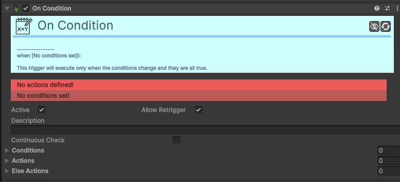
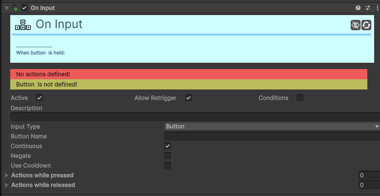
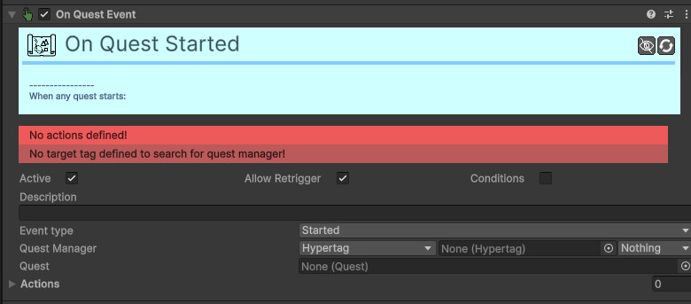

# Trigger

Os **Triggers** são o cérebro do jogo. Eles monitorizam o mundo e decidem **quando** as ações devem ser executadas.

---

### [On Collision Trigger](component/trigger/Trigger-On-Collision.md)
O **Trigger On Collision** dispara ações quando ocorre um contacto físico ou sobreposição entre dois objetos.

| Campo | Função | Detalhes |
| :--- | :--- | :--- |
| **Active / Retrigger** | Comuns. | Define se o trigger está ativo e se pode disparar várias vezes. |
| **Conditions** | Condições. | Lista de precondições necessárias para disparar. |
| **Is Trigger?** | Tipo Sensor. | Se ativo, reage a colliders do tipo **Trigger**. Se não, a colisões sólidas. |
| **Event Type** | Momento. | **Enter** (Entrada), **Stay** (Enquanto toca), **Exit** (Saída). |
| **Tags** | Filtro. | Lista de Hypertags que ativam este trigger. |
| **Actions** | Ações. | Lista de ações a executar no evento. |

### [On Condition Trigger](component/trigger/Trigger-On-Condition.md)
O **Trigger On Condition** verifica constantemente se um conjunto de regras é verdadeiro para disparar ações.

| Campo | Função | Detalhes |
| :--- | :--- | :--- |
| **Continuous** | Contínuo. | Se desativo, as ações só correm uma vez ao tornar-se verdade. Se ativo, correm em todos os frames. |
| **Conditions** | Regras. | Lista de condições (ex: Life > 0). Todas devem ser verdadeiras (**AND**). |
| **Actions** | Sucesso. | O que acontece quando as condições são cumpridas. |
| **Else Actions** | Falha. | O que acontece quando as condições **NÃO** são cumpridas. |

### [On Every Frame Trigger](component/trigger/Trigger-On-Every-Frame.md)
Executa ações constantemente, a cada frame do jogo.

*Este trigger não possui configurações específicas, além das Precondições e Ações padrão.*

### [On Grid Event Trigger](component/trigger/Trigger-On-Grid-Event.md)
Deteta interações específicas do sistema de grelha (Grid).

| Campo | Função | Detalhes |
| :--- | :--- | :--- |
| **Event Type** | Tipo de Evento. | **Hit Wall** (parede), **Push Object** (empurrou), **Step End** (parou numa casa), **Rotate End**. |
| **Tags** | Filtro. | Filtra quais os objetos que ativam eventos de contacto ou empurrão. |

### [On Input Trigger](component/trigger/Trigger-On-Input.md)
Permite ligar comandos do jogador (teclado, rato, joystick) a ações.

| Campo | Função | Detalhes |
| :--- | :--- | :--- |
| **Input Type** | Fonte. | **Button**, **Key**, **Axis**, **Any Key**. |
| **Key** | Tecla. | Escolha a tecla específica (apenas no modo Key). |
| **Continuous** | Pressão. | **Sim**: Dispara enquanto mantém premido. **Não**: Dispara uma vez ao carregar. |
| **Use Cooldown** | Cadência. | Limita a velocidade com que o trigger pode disparar novamente. |
| **Else Actions** | Negativo. | Ações para quando a tecla **NÃO** está a ser premida. |

### [On Quest Event Trigger](component/trigger/Trigger-On-Quest-Event.md)
Dispara ações quando o estado de uma missão muda (início, fim ou falha).

| Campo | Função | Detalhes |
| :--- | :--- | :--- |
| **Event Type** | Momento. | **Started**, **Failed**, **Complete**. |
| **Quest** | Missão. | A missão específica a vigiar. Se vazio, vigia **qualquer** missão. |
| **Quest Manager** | Gestor. | O componente central de missões. |

### [On Start Trigger](component/trigger/Trigger-On-Start.md)
Dispara ações no momento exato em que o objeto é criado ou a cena começa.

*Este trigger não possui configurações específicas, além das Precondições e Ações padrão.*

### [On Timer Trigger](component/trigger/Trigger-On-Timer.md)
Dispara ações baseando-se em intervalos de tempo ou atrasos.

| Campo | Função | Detalhes |
| :--- | :--- | :--- |
| **Active / Retrigger** | Comuns. | Controlo de ativação e repetição do temporizador. |
| **Conditions** | Condições. | O timer só conta se as condições forem verdadeiras. |
| **Trig. At Start?** | No Início. | Se ativo, dispara as ações imediatamente ao começar. |
| **Init. Delay En.** | Atraso. | Ativa um tempo de espera extra antes do primeiro disparo. |
| **Time Interval** | Intervalo. | Tempo entre disparos (suporta intervalo aleatório Min/Max). |
| **Actions** | Ações. | O que disparar quando o tempo termina. |
