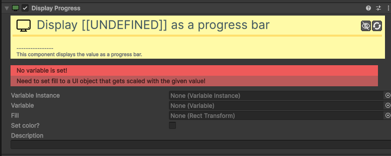
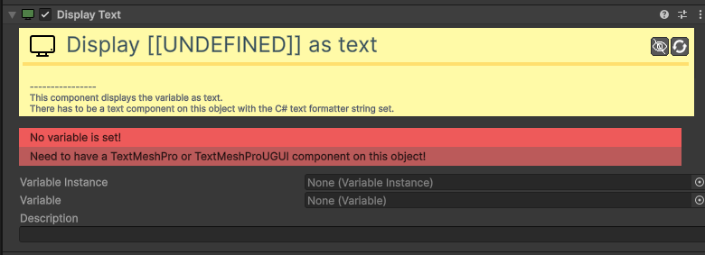
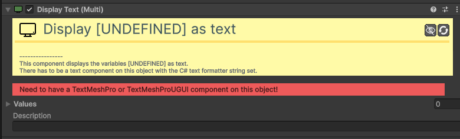

# UI

Os componentes de **UI** permitem exibir informações do jogo no ecrã de forma clara e profissional.

---

### [Value Display Image](component/ui/ValueDisplayImage.md)
Ideal para indicadores estilo "corações" ou inventários visuais.

| Campo | Função | Detalhes |
| :--- | :--- | :--- |
| **Var. Instance / Variable**| Fonte. | Escolha entre uma variável local (no objeto) ou global (asset). |
| **Description** | Descrição. | Campo para notas internas do desenvolvedor. |
| **(Children)** | Imagens. | O componente liga/desliga automaticamente os objetos filhos conforme o valor. |

### [Value Display Progress](component/ui/ValueDisplayProgress.md)
Cria barras de vida ou energia que enchem e esvaziam dinamicamente.

| Campo | Função | Detalhes |
| :--- | :--- | :--- |
| **Var. Instance / Variable**| Fonte. | Escolha entre uma variável local (no objeto) ou global (asset). |
| **Fill** | Barra. | O objeto `RectTransform` que vai esticar/encolher (a barra). |
| **Set color?** | Mudar Cor. | Se ativo, permite alterar a cor da barra dependendo do valor. |
| **Description** | Descrição. | Campo para notas internas do desenvolvedor. |

### [Value Display Text](component/ui/ValueDisplayText.md)
Exibe o valor de uma única variável num campo de texto (pontuações, cronómetros).

| Campo | Função | Detalhes |
| :--- | :--- | :--- |
| **Var. Instance / Variable**| Fonte. | Escolha entre uma variável local (no objeto) ou global (asset). |
| **Description** | Descrição. | Campo para notas internas do desenvolvedor. |
| **(TextMeshPro)** | Saída. | O valor será escrito no componente de texto presente no objeto. |

### [Value Display Text (MULTI)](component/ui/Multi-Value-Display-Text.md)
Permite exibir várias variáveis formatadas num único campo de texto (ex: "HP: 10/100").

| Campo | Função | Detalhes |
| :--- | :--- | :--- |
| **Values** | Valores. | Lista de variáveis locais ou globais a exibir. |

